# The Galilean Moment of Quantum Mechanics

!!! Attention: This work is still in refinement stage until 23rd or September 2025. After this, I hope I can limit myself to minor revisions and pointers to other contributions. Until then, everything you read is provisional.

## Abstract

In this publication, I will discuss Carlo Rovelli's Relational Quantum Mechanics (RQM) and how it aims at resolving the measurement problem. Once I have explained how I think it works, I will point out an obvious type of criticism and how Rovelli tried to fix the problem. After this, I will show why it does not fix the issues, suggest a *much* better fix and discuss why, in my opinion, academia missed this despite being obvious and how this is just the tip of the iceberg of much more fundamental problems with western society.

## Table of Contents

- [The Galilean Moment of Quantum Mechanics](#the-galilean-moment-of-quantum-mechanics)
  - [Abstract](#abstract)
  - [Table of Contents](#table-of-contents)
  - [Note](#note)
  - [Back to Materialism!](#back-to-materialism)
      - [Wigner's Friend: A Thought Experiment](#wigners-friend-a-thought-experiment)
      - [Fixing Rovelli](#fixing-rovelli)
      - [Summary of my Two Postulates](#summary-of-my-two-postulates)
  - [Road To Formalization](#road-to-formalization)
      - [The Wrong and the Right Question](#the-wrong-and-the-right-question)
      - [The Math](#the-math)
      - [Why Does This Not Break Things?](#why-does-this-not-break-things)
      - [The Big Picture](#the-big-picture)
      - [Research Directions](#research-directions)
  - [Some More Philosophical Consequences](#some-more-philosophical-consequences)
  - [Victory of the Little Guy](#victory-of-the-little-guy)
  - [The Scientific Struggle](#the-scientific-struggle)
  - [To the Suffering Peoples of the World](#to-the-suffering-peoples-of-the-world)
  - [Confirmation of the Prophecy](#confirmation-of-the-prophecy)
  - [Terms of Use](#terms-of-use)
  - [Acknowledgements](#acknowledgements)

## Note

Western audiences may find it odd to mix physics with political philosophy. For me, political philosophy is just another field of scientific inquiry and historically, [the idea of combining the two is not that odd](https://en.wikipedia.org/wiki/Galileo_affair). The western reader is asked to patiently read the text in the linear order intended by the author to maximize the chance of understanding the meaning.

## Back to Materialism!

In [1996/97, Carlo Rovelli](https://arxiv.org/pdf/quant-ph/9609002) introduced the idea that descriptions of quantum systems could be observer-dependent. Here, "observer" does not refer to any "conscious" or "macroscopic" entity, but returns to the more sober and naturalistic meaning that the term used to have in physics prior to Quantum Mechanics - and which it still has in Special and General Relativity.

To motivate the idea of observer-dependence, he proposed a thought experiment which has since been [pointed out](https://arxiv.org/pdf/1710.07556) to be a restatement of the old thought experiment of Wigner's Friend. For the sake of clarity, I will therefore motivate Rovelli's idea starting from Wigner's Friend.

#### Wigner's Friend: A Thought Experiment

Eugene Wigner, like many physicists, once wondered what exactly constituted a measurement and what the mysterious "collapse of the wave function" during a measurement might mean.

For him, the collapse had to have something to do with quantum systems interacting with consciousness. Here's how he justified this:

Suppose, instead of Wigner himself conducting a quantum measurement, he would have a friend conduct the measurement. Wigner himself would stand outside of the lab. So far, so good.

Now, after the measurement, Wigner's friend comes out of the lab and is asked by Wigner about the outcome of the experiment. Notice something here: *from Wigner's point of view*, if quantum mechanics is correct, the answer must at this point be described using a superposition between the different possible outcomes. It is only upon hearing (i.e. "measuring") the answer that Wigner's description can collapse to a single state.

So, does this mean that Wigner's friend was in a superposition until that point as well? Well, let's find out! Wigner asks his friend: "what did it feel like to be in a superposition?" His friend looks confused, then replies: "What do you mean? I was not in a superposition!"

And this leads Wigner to the "only" correct interpretation: consciousness collapses wave functions! -

Yeah, except that this is obvious nonsense and has since been challanged in various ways. Today's consensus seems to be that it's not about consciousness, but about interactions with macroscopic environments which "decohere" into a single classical reality (more on this idea later).

In his key contribution, Rovelli added his own unique take: What if Wigner's friend truly *is* in a superposition - *for* Wigner? Yes, you read this right: Rovelli's solution boils down to stating that superposition for me can be facts for thee and vice versa.

In particular, this means that for Rovelli, the wave function is epistemic: it's just a book keeping tool to account for the state of systems that you have not interacted with yet.

You know what? This is actually a genius idea! I am *not* being sarcastic here. It's the *exact* type of idea that got us from Newtonian physics plus weird Lorentz transformations to account for the constancy of the speed of light for any observer to Einstein's relativity - and Rovelli is bold enough to draw this comparison himself in his initial paper.

Except, it doesn't quite work. Here's the problem:

If something can be a fact for one party (say, Alice), in limbo for another party (say, Bob) and once again a fact for a third party (say Charlie), who or what guarantees that Alice's and Charlie's facts agree once Bob learns of Alice's and Bob's notes?

Well, an [ad-hoc postulate](https://philsci-archive.pitt.edu/20379/1/RQM%20paper%20copy.pdf) does. After a quarter of a century, this rather obvious weak point had become bothersome enough that Mr Rovelli felt the need to just assert that this should work.

This attempt is not without merits. At least, it hints at an ontology that could be responsible for this to work: each observer just carries the information about their measurement records around on some way, for example in correlations between observables. Nice! We avoid hidden variables simply by using *statistical correlations* as the locus of physical information. Very elegant move!

But somehow, this is still quite slippery. Rovelli's idea how all this fits together forces him to write something like this:

*This postulate implies that the information stored in Alice’s physical variables about the variable V of the system S is accessible in principle to any observer who measures her in the right basis, so at least at an emergent level this information about V is an observer-independent fact.*

Excuse me? What if I measure her in the wrong basis? Is the information forever inaccessible to me? What does measuring "someone" in the wrong basis even mean?

Honestly, this sounds like Rovelli's interpretation slips right back into some version of Many Worlds - a criticism that he has been struggling with from the start. And indeed, the "fix" for this is to be found in the exact same place as with Many Worlds, as the "at an emergent level" part of the sentence I quoted gives away:

*It is clear that decoherence should play some role in this story. And in fact, decoherence provides exactly what it needed here: it picks out a basis which is dynamically favoured and then disseminates information stored in that basis through the environment.*

Mr Rovelli, didn't you want to treat the wave function as a book keeping tool rather than something physical? So, what is it that "decoheres" here? Certainly not quantum branches, right? How can a set of systems "decohere" into a single reality - unless you basically allow an ontic wave function and even Everettian branching again?

Alright, and *this* seems to be the state of the art here! At least as far as I am concerned, the mysteries have not *quite* gone away. If we invoke decoherence to explain the "emergence" of stable facts at the macroscopic level, we would have to say *what* decoheres. So, back to the drawing board!

#### Fixing Rovelli

What if we went a little further than Rovelli and simply treated facts as facts? That is: *measurement bases be damned*, once an interaction happened, *it is a fact*.

But hold on! Is this not in a direct contradiction with the idea that facticity or superposition should be *relative* to an observer, that is, *observer-dependent*? How can an interaction that happened *just be a fact* when *at the same time* we require that another observer who doesn't know about the interaction record yet could somehow still *validly* describe the situation as a superposition?

The answer is actually somewhat obvious once you read it. It is *so* obvious that I couldn't *believe* that it hadn't occurred to anyone for a quarter of a century - at least to my knowledge.

Mr Rovelli, was your theory not supposed to make Quantum Mechanics *directly* compatible with Special Relativity? In Special Relativity, whether an event has happened or not is *relative* to the observer! Just because the interaction already resides in the causal past of Wigner's friend, this does not mean that it is already in Wigner's causal past!

For the casual reader who might be confused about this, you can find a nice explanation how the speed of light is related to causality [here](https://www.youtube.com/watch?v=msVuCEs8Ydo) and how relativity of simultaneity (within a discussion of relativistic length contraction) [here](https://www.youtube.com/watch?v=TxW6_E3uLuo).

The above insight leads to a *natural* refinement of RQM. It is *not* an ad-hoc axiom or postulate, it is *well motivated* by known physics:

**Interaction records are factual for any pair of observers such that the interaction resides in the intersection of their causal past.**

If we simply dump everything we consider a definite fact into the shared causal past of all the observers for whom we require agreement, these facts can simply not bother any other observer; for there are only two other types of observers:

- Those who can never interact with the fact because, for example, they have fallen into a black hole  
- Those for whom the fact lives in the future and for whom the wave function is the absolute horizon

Once we make this adjustment - which is *squarely justified* by our current secure knowledge of the universe (but needs to be handled with a little more care later) - a lot of things suddenly make sense.

Let us now take a walk through the freak show of Quantum Mechanics like Thanos would because ... we kinda can:

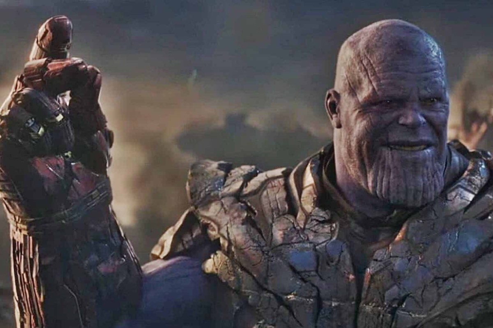

**Schrödinger's Cat** - dead and alive, but what people forget to mention *even though basic relativistic common sense screams it in their face* is that learning about the live/dead state of the cat *implies* learning about whether the atom has decayed that would trigger the mechanism that would kill the cat. That is all that entanglement encodes! Information about an interaction entering your causal past means that an *entire consistent causal history* enters your causal past. If we position the experiment in such a way that the trigger is behind the cat from our perspective, the information about the entire sequence of events enters our causal past all at once.

**Retrocausality** - This one doesn't even need any special interpretation to be [thoroughly debunked](https://www.youtube.com/watch?v=RQv5CVELG3U), but I think the ontology we are building towards here suggests that Quantum Mechanics actually yells at us precisely that retrocausality is *not* real.

Think about it: when we see an interference pattern on the screen behind a double slit, isn't this precisely the universe telling us that it *can not* retroactively *create* the information through which slit the particle has gone? Because, if we were to see two peaks rather than an interference pattern, this *would be* nature coming up with a so far non-existant history on the spot. Once the particle has definitely made it past the double slit without being constrained to go either through the left slit or the right slit, we have condemned the particle's position *at this time* to be in a superposition for all eternity and that's all there is to it. It can have a position later if we measure it, but whatever we measure must be consistent with the particle *not* having had a definite position when it went through the double slit.

**Decoherence** - hitherto, it was assigned the role of Descartes' Demon who modern science has demoted from an intellectual tool to *criticize* our own bullshit to an underpaid lab assistant tasked with *justifying* the bullshit: The other branches are still there, we're just extremely isolated from them; *Therefore* (!), our inability to see other quantum branches is just our senses playing tricks on us.

But why should we evolve a consciousness so poorly suited to perceive actual reality? Suppose, the dinosaurs had survived on some other such “quantum branch” and were at the brink of developing the ability to perceive those hidden dimensions. Being eaten by an interdimensional T-Rex is quite a terrifying thought!  

Luckily, it is not real.  

All that decoherence does is to quantify to what degree small things enter into fewer relationships than big things, therefore revealing less about themselves to the universe than big things do. It estimates and quantifies the *“relationship density”* of a thing: for an individual particle, *it is perfectly fine* not to go through the left or the right slit at the double slit *because* it has so many ways *not to* interact with the world.

Think of it this way: if I was moving through outer space, I would always (in principle) be able to know where I am because I can triangulate my position relative to distant stars. We macroscopic entities live in an Argus universe, a quantum panopticon.

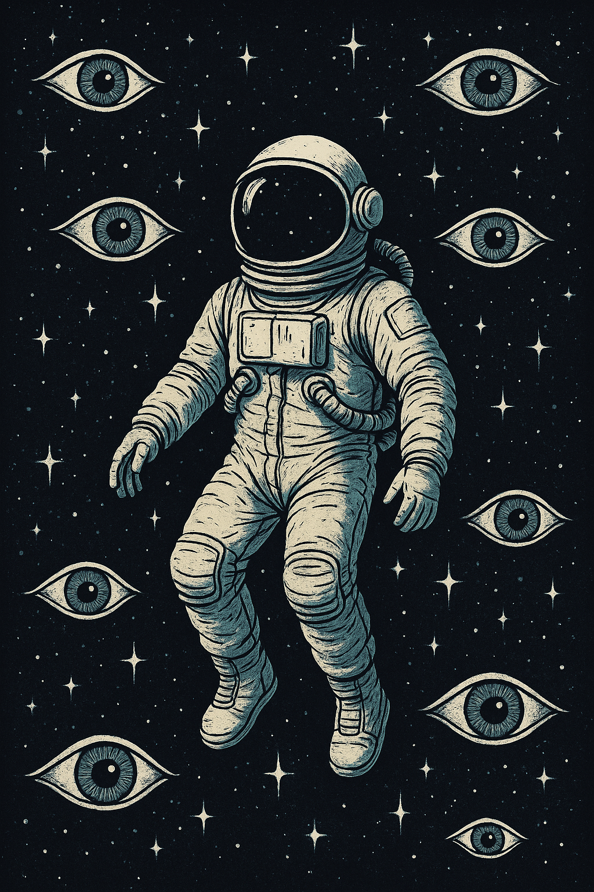

An electron, on the other hand, is not able to do that, because it is so small that the photons have a good chance to miss it. And then, *there is no fact of the matter*.

More philosophically: decoherence is “Hegel's Law” (“quantitative change [here: system size] leads to qualitative change [here: weird absence of facts vs classical facticity]”) of quantum mechanics.

**The Block Universe** - This one also doesn't really need a new interpretation of QM to be debunked, as it arises more out of General Relativity than Quantum Mechanics; the simplest criticism is that solutions to Einstein's field equations are solutions because they *satisfy* the field equations, thereby giving all observers (i.e. infinitesimal regions that experience a flow of time) a way to coexist even though that appears contradictory from a Euclidean/Newtonian point of view.

Still: if - as my observation suggests - the past is full of facts and the future *actually has not happened yet* for us, that makes the whole notion of the block universe even more sus. Also, just because you have a closed form solution that you can traverse forward and backward in whatever way you like doesn't mean that this is physical. Moreover, closed form solutions fail to exist even in simple cases as the Newtonian (!) general three body problem, so you're taking comfort in the false promise of knowledge when *you know* you don't have access to that nebulous Platonic ideal.

**Superdeterminism** - It depends on what you *mean* by it.

If you take it to mean that there are any laws that allow you to *predict* future events that are insufficiently constrained by facts inscribed into your causal past, I wish you good luck but I do not hold my breath.  

If you take it to mean that you can, in thought, place yourself at the heavens of the "end of all world lines", I will admit that this works, but *you just made that position up*, and the minute you forget that, you condemn your future self to wrestle with the same kind of nonsense that we are wrestling with in the present.

**Counterfactual indefiniteness** - Star Wars already knew the answer:  

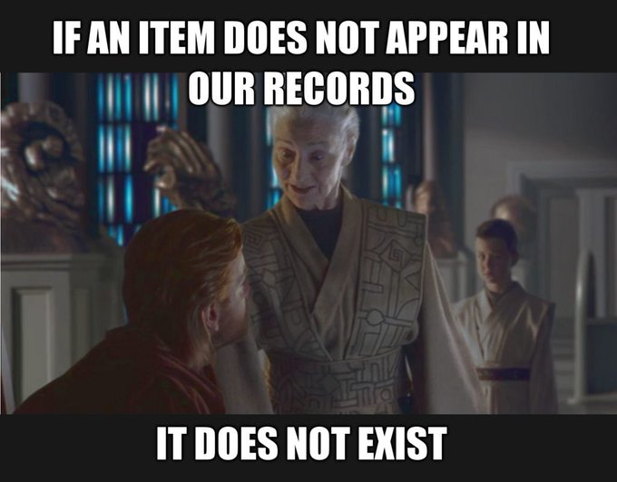

If an item does not appear in our records, it does not exist. 

Or to be more precise: What is *factual* is the record of the interaction, that is, the concrete values that observables took when interacting with each other (=measurement). The wave function is needed as an epistemic excess over the facts to explain their further development, making it at the same time ontic.

Now, you will say that this is contradictory bullshit, but if you do say that, I'm about to make you eat your words because there's *another* refinement we need to make to Rovelli's interpretation.

---

Rovelli's main point is that world descriptions should be *relative* to the observer. Rovelli himself then correctly concludes from this that the observer is *part* of the universe and we can not describe the universe "from nowhere in particular".

Very good, Mr Rovelli! (Again, if this sounds ironic or sarcastic, I apologize - I think this is genuinely good). But how to operationalize this? Alas, Rovelli is a little shy here. He assumes that Quantum Mechanics is basically complete, so we can just use its formal apparatus and maybe derive it from an axiomatic basis that makes sense. The best we get is some notation indicating that we are looking at a world description from a given perspective. That is a little disappointing.

**Alright, let's give it a shot then!**

Let us start with a simple observation: in everyday language, relativity "removes" facts. This is, I think, the trap that Rovelli has fallen into. What relativity *actually* does is that it *refines* our notion of what counts as a fact.

In mathematics, this is well known. It is the reason why we pin objects down "up to isomorphism" and work out properties that are invariant under these isomorphisms. In category theory, this concept is known as "universal properties". And in theoretical physics, there is a notion of "gauge invariance" that is related to this.

In the narrow sense, a gauge (here: Yang-Mills gauge) can be thought of as a set of symmetries so that contributions to interactions are redundant and naively summing them all up would over-count. It's basically a very fancy dx in an integral.

In a broader sense though, we come right back to the familiar notion from pure mathematics: if we know how spacetime works, we can change our coordinates - and whatever changes we observe through such a move, we would not interpret them as a change of the physical *facts*. That is: what is a fact is that which is left invariant under all admissible perspective changes.

Alright, let's do this for Quantum Mechanics then!

If I am a measurement aparatus, what is measurement *about* from my perspective? Fundamentally, it is about *other* quantum objects, *not* about me. I can not see myself directly! I *can* see what *other* objects are doing, but I must infer anything about myself from observations of the rest of the world. Whatever we do: to get a *complete* picture of reality, we must try to learn not only about the outside world, but also about ourselves and our causal impact *by using the universe as a mirror*.

This suggests that we have to restrict what we mean by "fact" to anything that is true from the point of view of any observer *as we leave this observer out of the picture*.

Here, it also becomes a bit clearer what an "observer" could even be. In essence, it's a set of correlated observables moving from one interaction to the next one. In general, such a "causal principle" can branch apart: just because the N observables all participated in one interaction, this doesn't mean that all N of them will participate in the next interaction - this should actually be more of an exception in general. But under certain circumstances, we end up with self-reinforcing interactions so we can treat all the involved observables as one very complex "macroscopic" observable.

Oh, and by the way: in case you didn't notice it, I have answered in what way the wave function is *both* epistemic *and* ontic at the same time now. Which by the way also answers why it seems to difficult to commit to either stance.

Pause here if you need another minute.

Ready?

Well, if the observer lives *inside* the universe, then *his* epistemic wave function through which he understands the past and predicts the future *must be physical*.

#### Summary of my Two Postulates

Let me repeat my two postulates again for clarity.

1. Real facts live in the causal past that any set of given observers share in common; that is: they live in the past light cone. Access to those facts is granted through interactions, and consistency becomes possible because facts are just facts.

2. Whatever counts as physically real must be invariant under perspective changes between different quantum observers which I take to mean any maximal set of correlated observables that participate in two successive interactions. This includes facts about particles at a given time that have been revealed through interactions (and that would not have meaning outside of the context of an interaction); but what is real *also* includes the wave function associated to each observer which *for them* can be interpreted as the epistemic connective between past and future - the substrate of cause and effect. A *perspective* is a description of the world that "leaves the observer out of the picture", that is, the observer is a set of *hidden variables* that he can only know about via inference over the outside world.

With all of this, [Bell’s beables](https://arxiv.org/pdf/2305.16194) become *becomables* which live at the same time at the point of an interaction *and* in the onto-epistemic wave functions growing out of interactions.

Let's see how this plays out!

---

Let us have a look at what my second postulate does for the Schrödinger’s cat thought experiment.

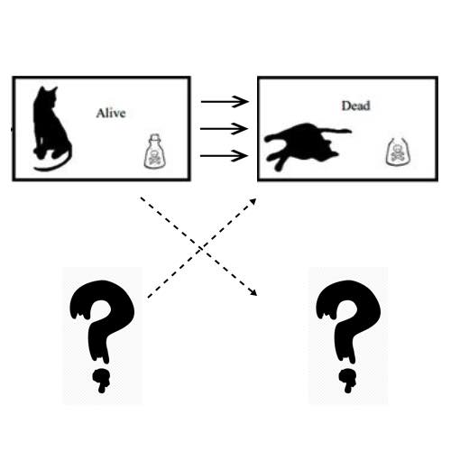 
It is *here* that we see most clearly (without formalizing it yet) what my second postulate *means*. Herr Schrödinger keeps checking in on the cat, say, every 30 minutes to see if the cat is still alive or not - until it is dead. But Herr Schrödinger can *only* observe the cat and the quantum contraption that will eventually kill the cat. He can *not* directly observe himself - yet he knows that he is somehow part of the story.
It is a *riddle*: Herr Schrödinger's task is not only to find out whether the cat is dead and alive; in order to understand the experiment *in its entirety*, he has to come to an understanding *about his own role* in the experiment. And since he can not see himself, he has to infer his own causal impact on the situation *by observing how the situation unfolds*. The situation becomes a *mirror* for him.
So, how do we have to complete this causal picture so it makes sense?

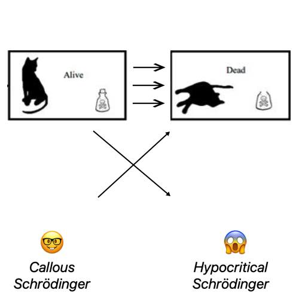

It’s *YOU*, Herr Schrödinger! Yes, you.

YOU killed the cat. Just because you put the knife into the hands of the Brutus that is the Cesium atom, this does not absolve you from your causal contribution. Saying “the Cesium atom’s decay caused the cat’s death, I didn’t make it decay!” is a CHEAP way out of your responsibility. YOU sick sadistic freak set the thought experiment up in such a way that the cat would *have to* die - the only thing you gave out of your hand was the information about when it would happen.

---

It would appear that we can now make sense of the wave function even at the macroscopic scale. The difference between quantum and macroscopic scales is indeed the extent to which facts are established through a gigantic web of interactions.

Let me point this out with another example.

If you saw a snapshot of a[ tea pot in space](https://en.wikipedia.org/wiki/Russell's_teapot), what would you think where it should go? I don’t know about you, but I would not have any expectation whatsoever, meaning I would have to begin with a totally unconstrained prior on its momentum which is at the moment *nowhere to be found* in nature.

Only when information about the position of the tea pot becomes causally available to me would it and I simultaneously *wake up* to each other’s position, while also giving us a hint at who we are, how we got here and where we’re going. It would appear that macroscopic "momentum" of relatively simple objects is just an encoding of the effectively very low dimensional causes driving the motion of the very dull system, and that talk of "momentum" of quantum objects is actually misleading. At the quantum level, it's pure causality!

In other words: The wave function is the substrate of *cause and effect* which in different setups constrains things in different ways.

With this, the following mystery also suddenly makes sense:

**The arrow of time** - Rather than being another delusion to be explained by some “consciousness” voodoo, it is directly encoded in the evolution of the facts which can only be explained by an objective fabric of causality that our neat wave function models can converge against. Entropy grows precisely because the storage volume of this fabric is bounded by the degrees of freedom of the wave function.

This last part about the possibility of information being *destroyed* is something that Rovelli toys with as well in his more recent work, but he does not commit to the claim that this necessarily implies time-asymmetry. My causal-past refinement *does* strongly suggest such an asymmetry.

## Road To Formalization

#### The Wrong and the Right Question

If the presentation so far has led you to believe that this is just the rant of a pop philosophical crack pot, you are profoundly mistaken and I will make you eat your words once more. Indeed, I will formalize parts of my second postulate and provide a mathematical picture so compelling that it is undeniable, yet also should be forbidden because a lot of very intelligent people will experience an existential crisis along the lines of "why didn't I think of this?"

Let me begin by opposing the question that has hitherto been asked with the correct question.

**The wrong question** is how we can justify the use of the Born rule by having it emerge from unitary evolution and then provide an ontological picture to make sense of that.

The problem is that it is impossible to have the Born rule emerge *exactly* from unitary evolution. Therefore, we do not *ever* have probabilities from which we could sample anything.

This is where even the otherwise very sober and honorable philosophical approach of [J. Barandes](https://arxiv.org/pdf/1405.6755) fails. He is more bold than Rovelli when it comes to facts being facts, but then (and here, he is less bold than Rovelli) introduces states that are completely epistemic. Our observer can only interpret the world, when the point is to explain how and why we can *change* it.

A novelty in Barandes' picture that deserves mention is that at least officially, he gives decoherence a different role than everyone else: by having ontic facts be facts, decoherence is free to act only on epistemic states. Except that in reality, they never decohere so much that we would ever be fully justified to apply the Born rule. Our detached, out-of-universe and rather [Feuerbachian](https://www.marxists.org/archive/marx/works/1845/theses/) observer is condemned to eternal indecision and nagging philosophical questions. Sad!

**The right question** is whether we can provide an ontology based on empirical fact and *good* philosophy, then present the existing formalism in a form suitable to *extend* it with a Born *axiom* (where we need a mathematical justification mirroring the philosophical justification), then complete the picture of the path space and justify why the differences are small enough so we have empirically never noticed them - but maybe could.

In the next section, I will provide the academic reader with the math so he can shut up and calculate. And it is *disgustingly* simple.

#### The Math

Since I am a mathematician and am a bit confused about the mathematicial dialect physicists speak, allow me to first introduce some notational "main characters" that show up all over the place.

Enter the "bra" $\bra{\psi}$ and the "ket" $\ket{\phi}$. These are just handy ways to denote row and column vectors in $\mathbb{C}^n$.

The setting that is appropriate to discuss my ideas is unitary evolution. But let us take a moment for a quick historic detour.

Historically, the first description of the full quantum state dynamics (as we currently understand it) was given by Schrödinger with his famous differential equation (see e.g. [here](https://site.physics.georgetown.edu/~jkf/grad_quant2/html/lecture25.html?utm_source=chatgpt.com)):

$$i\hbar \frac{d}{d t}\psi(t) = H(t)\psi(t).$$

Here, $i$ is the imaginary unit, $\hbar$ is a constant known as Planck's constant and $H$ is a (in general time dependent) Hermitian operator called "Hamiltonian".

In the time *in*dependent case, the solution is relatively straightforward (see derivation in the linked source):

$$\left|\psi(t)\right\rangle=\sum_n c_n(t_0)e^{-iE_n(t-t_0)/\hbar}\left|n\right\rangle.$$

But in the time *dependent* case, a general approach to practically solve the equation that even lends itself to numerical simulation is due to Feynman (see, for example, [here](https://web.mit.edu/dvp/www/Work/8.06/dvp-8.06-paper.pdf)): just discretize time steps, and whenever you have a wave function $\psi(t)$ at time $t$, the wave function at time $t+\delta t$ becomes, in each component, the sum over all possible complex continuations of the evolution:

$$\ket{\psi(t+\delta t)}\approx \ket{\psi(t)}+\frac{dt}{d}∣\psi⟩​\delta t=\ket{\psi(t)}−\hbar i​H(t)\ket{\psi(t)}\delta t,$$

where the minus sign comes from dividing by $i$.

Now, remember what this is supposed to encode though: we want to map complex unit vectors to complex unit vectors which locally should basically be a rotation which in complex math should involve an exponential. And here it is:

$$\ket{\psi(t+\delta t)} \approx U(t+\delta t, t) \ket{\psi(t)}, \quad
U(t+\delta t, t) \approx \exp\Big(-\frac{i}{\hbar} H(t)\, \delta t \Big)$$

where U is supposed to be a "time ordered" exponential.

Another way of looking at something that locally should be a rotation is multiplication with time dependent unitary operators. And lo and behold: $U$ is indeed unitary according to standard literature.

Since $H$ is technically an arbitrary Hermitian matrix that just so happens to encode something that physicists care about, a more statistics minded community has turned the path integral into a [different possible foundation](https://www.physics.umd.edu/courses/Phys851/Luty/notes/pathint.pdf) of quantum mechanics based on successive application of unitary matrices.

As a pure formalism devoid of statistical interpretation, this is quite similar to what Markov chains do - which I happen to know a thing or two about.

For my picture, I will put the Markovian and the Unitary picture side by side in a discretized form, while keeping the nice integral touch:

$$\ket{\psi(t)} \approx \sum_{j=0}^n \ket{\psi(0)} d P(j\cdot\delta t),$$

and we hope that mathematicians don't hurt themselves when taking the limit $\delta t \to 0$. This formulation can be thought of as unitary or Markovian evolution for now.

To arrive at dynamics for *coupled* systems, the underlying state space should be a cartesian product of possible states of the different protagonists.

In the Markov chain community, this is a no-brainer - that's how they do it. In unitary evolution though, the pairing of states is done only after moving to quantum "probabilities", leading to tensor products which appear mathematically awkward. So this may already be ***the*** the notational contribution of mine that makes what I am trying to do at all possible.

Just for the skeptical physicist: I am *not* talking about a Cartesian product of Hilbert spaces, I am talking about a Cartesian product of the underlying configuration spaces.

Let us think, for example, of two billiard balls $A$ and $B$, each with $\mathbb{R}^2$ as position space (remember that billiard balls move on tables):

$$S_{A,B} = \mathbb{R}^2\times\mathbb{R}^2 = \mathbb{R^4}.$$

In this now rather inconveniently encoded state space (but remember that with cartesian products, switching to other representations than a 4-vector is mere childsplay), we can introduce dynamics via a random walk on each participant, where we restrict ourselves to just the four major axes and a single stepwidth:

$$\begin{align*}P(X(t+\delta t) = y \mid X(t) = x) = &\frac{1}{4} \text{ if } y = x\pm v\cdot e_i,\\ &0, \text{otherwise},\\ &X=A\lor X=B. \end{align*}$$

Now, say that the billiard balls are dot sized and whenever they occupy the same place, we want them to collide. To make our mathematical lives easy and not think about momentum for now (we're drunken billiard balls!), let's just have the protagonists do something completely unphysical to get the point across: they'll just move together in their drunkards walk.

Here's how the dynamics looks in the Markovian picture:

$$\begin{align*}P((A,B)(t+\delta t) &= y \mid (A,B)(t)=x \land A(t_-) = B(t_-) \text{for some } t_- \leq t) \\
&= (\text{see above}).\end{align*}$$

Notice something? We somehow had to completely change the system dynamics to make that happen. Now, the two billiard balls no longer have their own transition probabilities, but they are updated together so as to maintain their correlated state.

This has *nothing* to do with the fact that we asked them to move together. I pulled that example out of my ass to keep the system simple. The dynamics are coupled because of the need to maintain correlations!

*This* is what Bell was getting at with his famous theorem: in a classical Markovian picture, correlation forces us to introduce *extra dynamics* to maintain it.

Sure: you could also have added velocities and imposed a realistic constraint on the correlation of the velocity after the interaction. But to make this correlation *stick*, you would have to make velocity dominate position evolution, and velocity itself would basically have to be deterministic. Otherwise, over time, the correlation imposed this way will still degenerate.

Not so in the unitary picture!

It is a well known [fact](https://arxiv.org/pdf/quant-ph/0407118) that unitary evolution in the non-interacting case preserves entanglement - the quantum analogy of correlation.

An "**interaction**" in both the Markovian and Unitary picture is just a pair of states (think: both billiard balls at the same place, but this is just modelling choice in my toy model) such that

$$\begin{align*}&P((A,B)(t+\delta t) = x,y | (A,B)(t) = a,b) \\ \neq &P(A(t+\delta t) = x\mid A(t)=a)\cdot P(B(t)=y \mid B(t)=b).\end{align*}$$

We literally *introduce* a correlation dynamically - and unitary evolution preserves it as long as there are no further interactions. That's all there is to it.

Except, that in the unitary picture, we have so far not seen a single thing that we could interpret as a probability. And honestly? This is a little mysterious. Think about it this way: we now have a dynamical system that can somehow introduce "correlations" - but what are the correlations *about*?

This is where my second postulate steps in, which says three things here:
- Facts are whatever is true at interaction.
- We do not need decoherence to explain facts. Decoherence can go and explain something else.
- Interactions are *mutual* quantum Bayesian updates between observers, where "observer" or "Bayesian" does not require consciousness or any of that voodoo.

Ok, so mutual Bayesian update. What could that mean? Let us consider an actual typical quantum experiment: a macroscopic measurement device with wave function $\bra{\phi}$ measures the position of an electron with wave function $\ket{\psi}$.

For this, the Measurement device uses *some* way to come up with a probability distribution on the electron's Hilbert space.

Enter [Gleason's Theorem](https://mathweb.ucsd.edu/~nwallach/gleasonq.pdf). Gleason says that the *only* way to do that is the Born rule.

And you know what? It turns out that if we treat both the apparatus and the electron as quantum, the Born rule predicting their *joint* probability looks like **this**:

$$P(X,Y) = \mid \langle \phi | \psi \rangle \mid^2.$$

Here's what's going on: our "measurement apparatus" is a simple yes/no device, and we just obtained the probability (a single number!) that the particle and the device will produce a "yes" fact. To obtain a more complex distribution, we just glue a ton of measurement devices together.

Now, here's where it becomes interesting: *if we assume the state of the measurement device to be fixed*, then we can condition on that state and the Born rules becomes

$$P(Y\mid X=\phi) = \|\psi\|^2$$

for the wave function encoding the interaction we're looking for.

But the funny thing about squares of scalar products is that they are symmetric.

The electron might just as well say that the probability of producing a fact with the measurement apparatus in this specific configuration is (taking into account its own known state)

$$P(X\mid Y=\psi) = \|\phi\|^2.$$

If the electron can do *that*, why wouldn't it also do it in the wild when randomly meeting other electrons? In fact, if we can *find out*, say, the spins of two particles that have interacted in an experiment after the fact, wouldn't it be awfully reasonable to assume that *there was* a fact?

In the picture presented so far, this is actually awfully simple. We are under no obligation to obey the Schrödinger equation here, since our starting point was unitary evolution which faithfully encodes Schrödinger's picture.

So, what's the fix?

Just require that interactions (in the unitary sense discussed above) are followed by application of the Born rule over the observables that have become entangled and notice that this preserves unitary norm. The fact that the probabilities over interacting states don't sum to one is immaterial. That simply means there is still a chance we don't participate in an interaction.

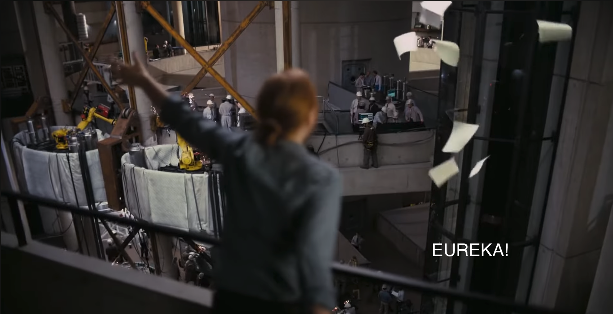

#### Why Does This Not Break Things?

In the case that a single particle and a measurement device are the only thing that ever interacts, this produces the correct predictions by construction.

In the case that particles interact, all that happens is that phase information (which is usually considered random) changes.

In the case of particles interacting in the wild, the interactions are too rare to meaningfully contribute to overall predictions. Also, nearby interacting branches tend to interfere away in the unitary picture, making it look a bit like a single measurement.

Honestly, it would seem that this is just something that hitherto, nobody has seriously considered - even though the philosophy (measurement *is* interaction) was there at least since Everett. The only concern about including this as another axiom was "but it would break unitary evolution!"

*And*? So long as we break it subtly and in a well-motivated way, that shouldn't be a problem, right?

Upon further reflection, it occured to me that the conventional choice to represent unitary evolution via tensor math contributed to people not daring to make this move: they did not quite know how to. If your formalism is solipsistic and interaction is more of an embarrassing practical necessity imposed from outside the map, it's difficult to even imagine how to do this. And imagine encoding this refinement into a modified Schrödinger equation - oh, the horror!

Notice that this simple fix *does* make predictions. It may be subtle, but math that is *known* to be different should make different predictions at least in *some* scenarios that people far more experienced than me should be able to find.

The only thing that you have to swallow is that we no longer have an operator *group* to encode evolution, but a only monoid. Or, if you represent the system as multiple individual agents, a category with some lossy morphisms. But weren't yall hunting for the holy grail of why the past appears different from the future? Well, there's your answer: it's because it *is* different from the future.

But you know what? If the changed predictions that come from the Born axiom are too subtle to be tested anytime soon, don't use it. It's an interesting interpretive twist so mathematicians and philosophers are finally happy to work with this. But **do** use the notational tweak I made! It does even less to change the theory as such - but it makes it *so much more practical* and in particular enables us to think of imposing constraints like Lorentz invariance in a whole new way:

Let $S$ be the global configuration space (a cartesian product over the possible configurations or all protagonists) and $\operatorname{Iso}(S)$ be the isomorphism group on S.

Let $G_I$ be a family of groups with index set $I$ encoding the symmetries we care about: Galilean symmetry, Lorentzian symmetry - you name it. Now, define

$$\operatorname{Iso}(S) \supseteq G := \bigcap_{i\in I}\operatorname{img}(f_i(G_i))$$

for a family of group embeddings into $\operatorname{Iso}(S)$ associated with each $G_i$.

Our dynamic operator $P$ must be a (not necessarily linear if we consider the Born rule fix) unitary norm preserving map $P:\mathbb{C}^S\longmapsto\mathbb{C}^S$ such that for all $f\in G$

$$\hat{f}\circ P\circ \hat{f}^{-1} = P,$$

where

$$\begin{align*}\hat{f}:\mathbb{C}^S &\longmapsto \mathbb{C}^S,\\ \hat{f}(\phi_s) &\mapsto \phi_{f(s)}.\end{align*}$$

That's a trick we have hitherto been using on *each object's* Hilbert space, but never on a global Hilbert space encoding the big picture.

To the western academic who somehow has missed this even though they are way smarter than me, I want to say:

You don't want to sell us any more quantum opium, you want to go home and rethink your lives.

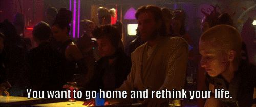

#### The Big Picture

We now have a group of evolution operators (or one big evolution operator of a unitary followed by local Born rule applications in interacting states) that deserves a bit of reflection.

As in the Markovian setting, applying our evolution operator(s) means that we are advancing a probabilistic ensemble. *With my fix*, we now know where the probabilities live and can interpret *those* as the probability of certain interactions taking place at a given time.

*Conditioning* on interaction records is literally just a quantum Bayesian update. So is conditioning on a known state of the observer from whose "perspective" we are probing the ensemble.

Recovering the full system dynamics from the perspective of an observers should be possible by the remainder of my second postulate: a fully Bayesian approach where the observer knows that he knows nothing about himself and conditions his beliefs about himself and his causal impact on the past.

#### Research Directions

1. I have given a novel way to inject Lorentz invariance - or any other symmetry we care about - into the search criteria for dynamic operators in the path integral formalism. Whether the search space needs to include nonlinear operators that apply the Born rule at interaction, I do not know. But at least, we have a new way to even look for an answer and I hope that this will produce results that differ in fundamental ways from QFT. This would be exciting, and the predictions coming out of *this* would probably be testable much sooner than my Born rule idea.

2. General Relativity suggests that gravity is just coordinate-frame carrying masses fighting it out with each other, constantly trying to reconcile their different notions of up, down, left, right, back, forth, past and future. With my picture of Quantum Mechanics, *this makes sense now* at the quantum level: No more discretization of spacetime, no more quantum foam, no more Calabi-Yaus. Particles are *real* at interactions and this reality leaves a trace, and outside of interactions, you can not say anything. They *carry* their own coordinate system, and they fight it out through interactions.

3. Personally, I find it very satisfying that treating epistemic wave functions as ontic solves things philosophically. You know what would be even greater? If we could somehow treat the wave function as latent in the correlation between interaction-facts (that is: the real statistical trace left behind by interactions, *not* the mathematical ghosts moving through Hilbert spaces). The idea that quantum information could just be living in correlations of interaction-facts - extending that in such a way that material agents express their quantum expectations in the correlations of interaction-facts would be huge. Don't forget: quantum mechanics lives in books, storage devices and our material practice, not some otherworldy Platonic ideals.

4. This leads me to a "second decoherence conjecture": can we find, in this new version of quantum mechanics, some explanation why sufficiently complex quantum agents would be interested in bringing the universe *for itself* (onto-epistemic wave function) in congruence with the universe *in itself* (record trace of interaction-facts)? At least, we have for the first time a probabilistic calculus that allows the system to reason about itself, so we can treat this question *in the model*.

Let me leave you with two more musings on further directions, but these are really just musings:

1.  Maybe it helps to think of our motion through time in a similar manner as the Babylonians did - we face *towards* the past and go *backwards* into the future.

2. Notice also: if a great mass is exactly behind your back, the only way you'd know is because of inexplicable motions of objects in your vincinity and even of distant stars...

## Some More Philosophical Consequences

Let me close the physics part with a few more consequences that follow either "in spirit" or even in a strong sense.

Here's an "in spirit" consequence:

**"Free Will" -** We make arbitrary "choices" as long as we are ignorant the consequences of our actions. As we become aware of the consequences through experience, we can not help but make more predictable choices. This is the old Hegelian paradox of [freedom as insight into necessity](https://www.marxists.org/archive/marx/works/1877/anti-duhring/ch09.htm): our freedom of choice *diminishes* as our freedom from ignorance grows. And in the Quantum picture, the development from arbitrariness to clearly predictable patterns (thanks to tons of constraints through relationships) ceases to be merely epistemic and becomes ontic.

Strong consequences:

**Quantum Field Trickery -** I must admit that as a casual observer of physics, this one almost escaped me. Apparently, quantum fields were more of an ad-hoc invention to "resolve" contradictions of earlier attempts to make Quantum Mechanics relativistic - a trick that even physicists appear to have a hard time accepting, but it just works too well.

If further research on my well-motivated formalism could *at least* give us a nicer way to reproduce predictions from QFT, I would be extremely satisfied.

If, on top of that, it could give us a better explanation for effects that are currently explained by "vacuum energy" and dissolve "vacuum energy" into vacuum, it would be a total victory for the philosophy that enabled me to pull all this off and that anyone who wants to walk in my footsteps should take seriously and study.

**Causal Direction -** Another good insight from Hegelian philosophy that I can find *immediately* represented in this picture (and this is, I think, a hard consequence) is that cause and effect seem to somehow change place and thereby become the same thing. Let me unpack this a little.

Right at the point of interaction, there *is no* cause and effect. That’s why we call it an *inter*action to begin with! Every participant is equal - but it doesn’t *look* like it.

If we were to model the point of interaction between The Cesium atom, the cat and Herr Schrödinger as an evolving Hilbert space of dimension 3 (that is, only these three objects exist in the universe) and repeated the setup where the three are aligned with the cat in the middle, Schrödinger would indeed see the Cesium atom “cause” the cat to die. But the Cesium atom would be well within its right to complain that Schrödinger going from 🤓 state to 😱 state caused the cat to die!

From the cat’s point of view, it just sees two sick and evil things conspiring against it. And about itself, it will probably think: why didn't I run while I still had time?

In the above, we see some of the “relative facts” that Rovelli was looking for. But they are relative precisely because they’re not facts at all.

It is *only* when we take *shared* knowledge transport through further interactions into account that cause and effect emerge. It is not really the decay of the Cesium atom that kills the cat, but a sequence of interactions - all dutifully recorded by Herr Schrödinger who does nothing to save the cat! - that leads to the release of poison which then kills the cat which too is not an instantaneous process but a ton of interactions.

---

That’s the type of shit that people leaning towards analytic rather than continental philosophy would miss. Their logic is instrumental to solve problems, but it can never stop and ask what the problem even *is*.

Let me drive this home in a very immediate way: do you think this text contains any knowledge whatsoever? If you just thought “yes”, then *you are a fool*.

As Hegelians knew for ages: [he who studies the past is studied by it](https://www.youtube.com/watch?v=PIz4fNrdpWU) (Yes, Hegel *did* watch that DS9 episode, making either him or DS9 the only instance of time travel allowed by the laws of physics). This text is studying you, judging whether you are worthy of the mutual knowledge that could be produced between you if you cared enough to seriously engage with it and refine your understanding, possibly by reaching for outside references if you get stuck.

 What I am saying here is that knowledge is *produced* and *reproduced* as you engage with a text. *Nobody* today knows what, for example, the Incan Quipus (their knot-encoded “written” language) *meant*. Maybe, one day, we succeed in recovering this information by stumbling upon outside reference, but to us, they are mostly a riddle - all because past actions have cut the present off from those who knew how to read them.

By the way: I mean this quite literally. We are teasing out an important distinction here: *information* versus *knowledge*. If we follow Rovelli's reasoning, this physical instance of the text that you are reading - no matter if it's represented with ink or bits and pixels - *contains* information about some causally potent principle, the "abstract" text. *Your* engagement with the text reproduces and produces *living* knowledge.

And yes: If we take "causal information = correlation" to its logical conclusion, this means that the evolving *meaning* of the text for different readers is as physical as the momentum of an asteroid floating through space (which, by the way, is also observer-dependent as an observer in the same rest frame would describe the asteroid as stationary). And if you can still take me seriously here, I would hope that this gives you pause when scientists in other disciplines try to explain things in mechanistic terms while ignoring more complex channels of causality.

 That you can find your own causal impact in the world that you live in can literally be understood as "what goes around, comes around". Actions have consequences, and with great power comes great responsibility. Your attitude to the life, the universe and everything *matters*.

And if what I wrote contains any truth, then I can proclaim **metaphysics dead again**!

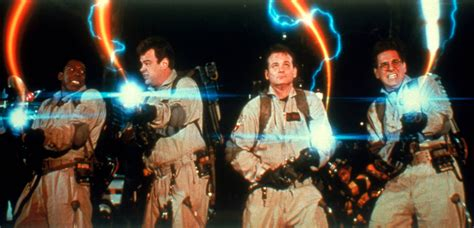

---

One very last thing on the science part: I want to suggest a name for what I discovered.

Initially, I considered [“dialectics of nature”](https://www.marxists.org/archive/marx/works/download/pdf/dialectics-nature.pdf) to reuse a title of a posthumously published book by Friedrich Engels. Just "dialectic materialism" also came to mind.

But when I worked more and more through the consequences and realized *just how much* about the causal structure of the universe this reveals, I came to think as this in terms of a single slogan:

[*The riddle of history solved.*](https://www.marxists.org/archive/marx/works/1844/manuscripts/comm.htm)

And just as much as Marc-Uwe Kling’s first person narrator in the "Kangaroo Revelations" *had to* play a dramatic sound effect on his smart-phone after hearing the Kangaroo’s revelation, I could not forgive myself if I didn’t use this once-in-a-lifetime opportunity to follow a clue left behind by someone else who [spent his life thinking about the big and pressing historic questions](https://www.marxists.org/archive/marx/works/1883/death/burial.htm) so relentlessly that he - like many prophets - didn’t have time left to shave.

The scientifically accurate name for this theory is:

**Communism.**

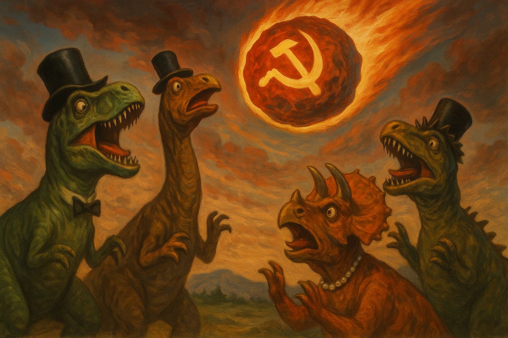

## Victory of the Little Guy

I apologize to the polite western academic reader whose feelings may get hurt here, but this section can be nothing but a victory lap of the outsiders (or *insiders* when you are in Chinese academia).

You may have noticed from my style: I am not some tenured professor or any other kind of creature you find in the holy halls of western academia. I am not even a patent clerk, nor do I have a Ph.D. I am just a lowly MES backend developer from Germany with an M.Sc., having majored in mathematics (minor subject: computer science).

Working *as an employee* in the private sector and solving real world problems has accustomed me to a different attitude when it comes to communication than tenured ivory tower dwellers. While western academia rewards caution, the private sector rewards commitment. When there is a problem and we think we know how to fix it, the right thing to do is to champion this idea and mobilize whatever resources are necessary (our work and the work of colleagues) to find out if our idea is correct or not. And if it ends up being incorrect - completely or slightly - there is no shame in admitting failure and completely rethinking our approach.

In this spirit, I will proceed from the assumption that the thoughts I layed out so far are not only correct, but will lead to the long sought after fixes that the foundations of our physical theories need.

Did Galileo not do something very similar? He did *not* have the full formalism yet - just very good axioms distilled from experiments. They were good enough for Newton to build his formalism on top of them! The only difference would appear to be that Galileo conducted the key experiments himself while I can rely on a lot of experimental data and previous work where academia was somehow just unable to add 2 and 2 together.

You know what? I do not expect western academia to accept my work in its current form anytime soon. I expect that other couragous individuals will have to build on top of my work before the timid bureaucrats and gate keepers whose minds are filled with idealistic nonsense will even *consider* risking to engage with my work. Therefore, I will not attempt to flatter western academic sensibilities by packaging my work in a form that is easily digestible to the weak of mind. I will instead fully lean into filtering my audience until only like 12 (caution: hyperbole) individuals worldwide remain who have the guts to engage with it in its current form with a lot of "lose ends", prove it and reboot a holistic mass educational culture with it. Western academia will have to grudgingly take the L once this additional work (which is too big for one individual with limited resources) has been done.

History is patient. Seeking the instant gratification of instant approval is what keeps a drug addict in his behavioral chains.

Is this not also a very Galilean move? Galileo did not phrase his insights in Aristotelian or Ptolemean terms to flatter the pornocracy residing in the Vatican. Nor did he stick to established scholastic bureaucratic language. Instead, he resorted to *polemics*.

Admittedly, he did this *after* he found out that the scholastic universities of his times would not engage. I, instead, will do this in *anticipation* that western mainstream academia will not give my work the time of the day anytime soon. There are just *too many* parallels to late medieval Europe, and my personal experience with gate keeping and lazy attitudes do *not* make me very optimistic.

**And let's be real here: if you reject this work *just because* its "ideological baggage" is a little uncomfortable - without providing a critique on the substance -, you weren't taking it seriously to begin with, thereby only proving my point. If you want to *disprove* my point, just stop reading here and build something new on top of my postulates. *I would love to be disproven.***

Still here? Good. The remainder of this text *is* "ideological baggage" that will prepare the reader for the struggles *I think* they will face if they take this work seriously and try to expand it. I'm just here to be real with you what you have to expect *if* you do this.

I hope the readers who followed my advice to just go build something on top of my postulates consider continuing to read here *if* they face the kind of push back that I anticipate (and I am fully prepared to eat my words and adjust my views if resistance is less significant than I expect).

Always remember that Newton was not just a genius, he also had *courage*. That's why Kant later wrote that you have to *dare* to use your own understanding.

**And in case that the brilliant minds that are at the same time courageous are too rare in the West at this point, I would *love* for Chinese, North Korean or Burkinabe researchers to prove the superiority of revolutionary education and research systems. If my contribution is as good as I think it is, this is international socialism's chance to decisively win the battle of ideas.**

**Disclaimer 1**: I am *not* here to make any personal attacks, but to expose structural brain rot (not of the [italian](https://italianbrainrotcharacters.com/) kind) which I want to offer to the western academics as a tough pill to swallow for some *serious* soul searching. What I have to say *will* make you feel uncomfortable. But science is not *supposed* to be a safe space, it is *supposed* to be about seeking truth. Ego has no place in it. Mine not either by the way! If I am wrong, I am wrong and that's the end of the story. Facts don't care about your feelings. Or mine.

**Disclaimer 2**: Going forward, when I say terms like "academia", "establishment", "insiders", "outsiders" and so on, I am referring to *western* society and those at the top/bottom of the old unipolar order that is in the process of falling apart. When I have something to say about BRICS, SCO or non-aligned countries (whom I am generally sympathetic towards), I will explicitly say so.

With that in mind, let us continue.

Let me begin by picking on Mr Neil deGrasse Tyson because - even though I believe he sincerely means well - is so beautifully prototypical for having things backward.

Two of his slogans/beliefs are:

1. The universe is under no obligation to make sense to you.  
2. Philosophy has nothing more to contribute to science.

I think in the light of the reception that I anticipate in the long run (!) for this pamphlet (I am engaging in a *social* experiment here and champion a prediction), these two ideas should now seem naive, stupid and most importantly: gate keeping.

While, as a Hegelian, I agree with Mr Tyson *wholeheartedly* - more than he could even imagine - on his first observation, the *context* in which he keeps bringing this up is just backwards.

*Isn’t science under an obligation to make sense **of** the universe*, Mr Tyson?

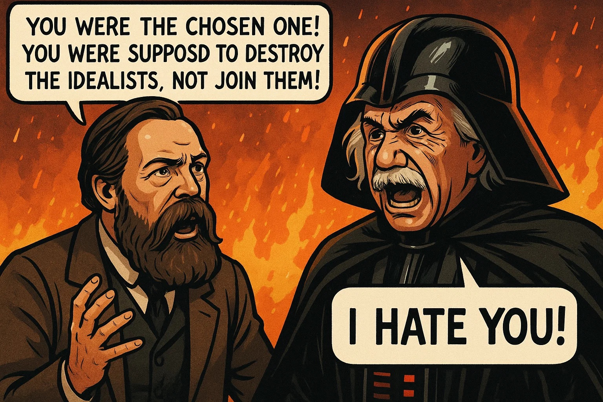

Now, you will surely say that this is what you have been trying to do. I also acknowledge your contribution to spreading the mystery and wonder and a lot of insight to the people - *how desperately we need this*! Moreover, I acknowledge that Mr Tyson has clarified that there *is* a free seat at the table for philosophers to contribute meaningfully - and another *huge* portion of the blame goes to philosophers who didn't dare to develop and use their own understanding. "Damn it, Jim, I am a philosopher, not a physicist" - sounds familiar?

But (and this is directed at academia as a whole rather than any specific person) by

- treating academia as a place where some holy scripture gets perpetuated in the exact way it was intended to be received rather than letting it vibe a little  
- treating definitions as gospel rather than recognizing the epistemic interest with which they were formulated and making adaptations when the epistemic interest changes
- treating experiment as a ritual by which we larp as the long gone giants, repeating exactly the steps by which they plucked insights from the tree of knowledge rather than encouraging the students to refine the question that the teacher asks with their own curiosity
- encouraging asking our own questions only at specific points in our academic career where it is necessary to satisfy the bureaucracy of titles, and only after years and years of conditioning us - from childhood! - almost *not to* ask good questions  
- valuing publication quantity over publication quality
- often hand waving your way through explanations - or even being outright dismissive - whenever a question is uncomfortable given your philosophical commitments
- thinking that truth can be meaningfully established through the inner-academic circle jerk of "peer review" rather than seeking the tax payers' approval (aka "people's review") for your general direction of inquiry

Academia has become a dead and barren place where groundbreaking discoveries have as little room as in universities at the end of the scholastic era.

**To put it extremely bluntly**: academia has become a *disgusting* place for people who can smell dishonesty from authority figures.

Do not get me wrong. I have met some *wonderful* people at university! A lot of my professors valued feedback from students. But *only* from students and other academics. It is as if they thought that meritocracy is a system where you can only come into positions of authority by having proven your competence; I for one think that a meritocracy is a system where you have to *keep proving* your competence throughout your entire career, even to lay people. *Notice the difference*?

I for one *could not stomach* the didactics of physics. After having *one* good teacher who gave me real confidence that the world could be understood, I took physics as a Leistungskurs (along with mathematics) - a lesson for life, as it would turn out. How readily our teacher would feed us *obvious bullshit* when discussing Quantum Mechanics and how no one except for me would give any *serious* push back (while neglecting to shut up and calculate, which would then hurt my grades) made me stay away from academic physics.

Mathematics seemed, at the time, to make far more sense which is why I ended up studying it - and believing a lot of bullshit from there (notably Platonism, initially the axiom of choice, and the law of excluded middle, but my first contacts with Marxism, computability theory and constructive mathematics had me reconsider; more intense exposure to Marxism had me throw Platonism out of the window as well - thanks, Friedrich Engels for giving us [Anti-Dühring](https://www.marxists.org/archive/marx/works/1877/anti-duhring/)!).

Just as a small tangent *in what way* I agree with Mr Tyson on “the universe is under no obligation to make sense to you”, here’s how a Hegelian thinks about *making* sense *of* the world: the world does not only make no sense, it is in fact *riddled* with nonsense.

Think about it. How is it possible whatsoever that things on Earth fall down, yet on opposite sides of the planet, they fall in opposite directions? I don’t know about you, but I call bullshit on that.

It is *us* who eventually come up with *cope* so we can live with this nonsense: we find that things are falling towards the center of the Earth, and “down” is *relative* (!) to the observer. But this is not the universe suddenly being reasonable, this is you finding a way to *rationalize* it.

And the nonsense is not even gone through this move! The initial observation is still completely valid! You just banged your head against reality often enough so your thoughts would resemble the facts, so much so that you can quantify how far you can travel on Earth before the “things fall down” view becomes nonsense and you need to move to [*better* nonsense](https://youtu.be/rrUvLlrvgxQ?si=31qsjb570l2KpxP_&t=355).

Don't believe me that the nonsense is still there? Well, let's ask a jury then. But let the jury be unbiased! So, who could possibly be unbiased in regards to the two propositions "things fall down" and "things fall in opposite directions on opposite sides of the planet"? Ah, that's right: a jury that hears this stuff for the first time in their lives - children! And you know what they'll say? They will say that this does not make sense - because it doesn't. We make sense *of* it!

Our mind is indeed extremely good at rationalizing bullshit - too good for its own good. Because we can also make sense of contradictions where half of the problem comes from you believing something that has been made up - either by you or by someone else.

The problem here is *not* that it is nonsense, but that it is nonsense that will only cause further trouble elsewhere in your way of thinking about the world. Rather than reading the room when everyone is telling you that “the flow of time not existing” or observers being “outside of the universe” are bullshit, you start making excuses because you are unwilling to commit to a search for hidden presuppositions.

The amount of nonsense that we bring in from our mind is indeed quite indicative of how wrong we get things. It is one thing not to know something, it is something else to make something up for no good reason *and then* treat it as true. And in the realm of pure fiction where nobody even pretends that it has a material underpinning, formal logic, a single contradiction immediately kills the entire theory.

To conclude this section, I must of course mention that the outsiders/dissidents who never lost contact with their inner child can not be spared from criticism either. And I acknowledge that this criticism can and should also be directed against me insofar as I abstained from formally studying physics because it seemed not to make sense at the time (though, in defense of my honor, I *did* study mathematics).

Just because you *see* that academia seems to systematically breed bureaucratic and barren minds who nevertheless *think* they are better than everyone else because they have jumped through all the right hoops and made a comfy career, this does not mean you can just stay away from the authority of competence.

While academia is, in my opinion, today largely incapable to ask any fundamental questions in the correct and honest way - constantly bringing in bullshit they made up and constantly bringing in their ego - *you* are dishonest as well if you do the same from the opposite end. If you fall into a habit of thinking that just because academia can’t see their own hypocrisy and you can, you have already proven your intellectual superiority and can just make shit up without first acquiring competence (what disgusting schizo abomination is [this](https://www.youtube.com/watch?v=VS3h6O-gD8c&list=PLeiyeZGQd2P8cll3bpxzLYoxlAfCabQmh) for example?! Flat Earthers and intelligent design folks are *tame* compared to what is out there), you are simply a mirror image of the academics that you despise, and you deserve to be despised twice as hard by them because they at least proceed from *some* established competence.

And the worst part if you take this idealist attitude? You never get to do anything about the problem you see so clearly while a lot of them can’t see it! This is just sad.

Yes: academia is rotten from the inside, and it *did* take one of us dissidents (in particular, a practical Hegelian, a *Marxist*) who don’t identify with academia to give it a decisive blow (if you are an early reader, just be patient, share and if you can, build on this work...). Socially, I *am* somewhat of an outsider: a wage worker, nowhere near the levers of power. Admittedly, I am not a blue collar worker, but I have come to appreciate y’alls grounded, down to Earth and pragmatic views on things on the interwebs where I interact with a bunch of you. You are the ones keeping it real, even if that hurts polite society’s feelings!

But if you do not learn how to handle technical and complicated things on your own, you will remain *dependent* on the academics (and the corporate overlords they serve) whose superior attitude you despise, thereby making your criticisms irrelevant. You *will not succeed* in delivering them what their inability to humble themselves demands: humiliation.

So, come! learn, friend! There are a lot of cool people on the interwebs who *do* make an effort to be the people’s teachers. They may still have their blind spots, but do it like the Chinese did and just “steal their technology” and then do things with it for which you do not seek their approval.

Blue collar workers - and workers in general - have nothing to lose but the chains of their self-imposed ignorance. They have a universe to conquer! Sapere aude!

## The Scientific Struggle

If you are not completely delusional, you will have noticed that the quantum opium the western academic dealers sell to the people nowadays is the mirror image of of a deep rot of western liberalism, and at the same time a mirror image of the medieval church's deal they had with the nobility: "we keep them stupid, you keep them poor".

Cautionary note here: I am *not* saying that a whole lot of academics are cynical like this. I think some of them *do* exist, and academia would do well to *expose* their own black sheep. That is: 

- do not scorn them just so they can go and build Trotskyist cult followings and claim they are the underdog seeking honest debate only to find closed doors. Do *not* make that claim come true.  
- do not address their deceptions *solely* behind the doors of peer review which are closed to everyday people since they are not technically versed enough to understand all the nuances.  
- do not address their deceptions *solely* through reaction videos or other popular commentary, as you are just building your own cult following and the followers of the liars will never even click on your videos.  
- instead, enter the arena of public debate with them. This *does* mean that you need to steelman their argument first so you know how to refute it *correctly*, and it does mean that you may get hit with some subtleties that you yourself have overlooked.  
  I know, I know: the *horror* that you could *learn* something from the bad guys! But it is the *only* way. Here and there, you may actually find true surprises about a gigantic incorrect assumption that you have never examined.  
  It also means that you need mastery not only of science, but of social skills - and this is hard. But the court of public opinion is the only place where truth ever *could* be established, if only there was real communication rather than echo chambers. If you fumble it and truth loses, well then at least you tried to do something meaningful and you can learn and do better! Do not run from the hard work. In the long run, truth *will* win! But *how* it will win and how long it takes depends on our collective skills in *fighting* for the truth - *including* the extremely uncomfortable work of critically examining our own contribution to the problem.

In short: what I ask people to do is to *actually* commit to public debates. However, this does *not* mean that I agree with the traditional western debate setup. If we politely treat the protagonists of a debate fairly so as to not hurt their feelings, we are treating truth extremely unfairly. Giving completely nonsensical opinions equal attention as well researched opinions amounts to criminal disregard for truth.

We should, therefore, proceed from Mao's take on freedom of opinion: no investigation, no right to speak!

But how does this rhyme with my proposal that we must do public debates? Isn't this *already* giving the enemy space to spread his bullshit? Well, no. *Not* engaging in public debate gives them *far more* space! Therefore, we must apply this lesson *per debate*. Do *not* let the enemy filibuster. If it is clear that they are stretching what they have to say just so their flawed argument gets extra space, *dare to be rude*. Interrupt them and use the reaction of the audience as your cue whether you are right to interrupt. In a sufficiently broad audience, the people do surprisingly well in judging this!

Conversely, how do we prevent that "no investigation, no right to speak" leads to someone with titles and stuff to abuse his authority? Well, once again public opinion does the trick! An audience who *knows* about the logical flaw of appeal to authority *will* not reward such bad faith.

But apropos court of public opinion:   
Historical precedent suggests that the people themselves must force the issue and (politely) bully the popular researchers they follow into real engagement. I have mapped four groups among the academics, and you can help by expanding it:

- The well meaning ones who unfortunately have developed resentment against the “stupid commoners“. Shake them up! Be polite, and if they cut you down, step back and come back with fellow travellers. Refine your approach as you go. Force them to live up to the standards their ancestors set.  
- The black sheep who claim to hold the truth and who claim they are just as excluded as you are. Do nothing, kick the cavalry into action. They will expose who is just a fraud and who might even be *paid* to lie.  
- Genuinely competent dissidents, raw and rare gems that only wait to be polished. Seek them out and learn from them. Importantly, learn to *distinguish* these from the former.
- Bureaucratic formalists who will, as this process starts to run wild, start to push back against the intrusions of the people into the holy halls of science. Eventually, they must be reformed or cast out of academia.

But notice something interesting about the frauds: they do seem to fall into two subcategories! The confused ones, and the paid ones.

Let us now test if *YOU* are among the confused ones.

Yes! That is right. Did I mention already that this text might be uncomfortable? It will only become *more* uncomfortable now. That is: for *western* readers. I would hope that Chinese readers will just smile at this - provided they are willing to entertain a little cultural exchange.

In fact, this text has LIED to you about its true nature! If you think this text is some weird superposition of a Zizekian pop philosophy lecture and some genuinely groundbreaking physical speculation in the raw that I should have polished more, then you are *profoundly* mistaken. All that has happened is that the text has succeeded in deceiving you - but according to the Shia God, that does *not* make it repulsive in the eyes of The Lord, as the lie was spoken in service of a holy mission.

I am not come to bring peace, I am come to bring the sword. In the good old tradition of Engels' contributions to philosophy of science, this piece of work is a philosophical siege weapon, and all the insights you have gained so far were only the cheese in the trap. You are so predictable, fool! To me as a German materialist hegelian, philosophy is not idle speculation, it is dead serious. In fact, to me, philosophy is WAR.

Now that I have taken your intellect as a hostage, the true meaning of the scripture is about to reveal itself to you. But only if you are insane enough to find my way of saying things irresistible rather than over the top and repulsive. You who yearn to break out of the dark night of ignorance, you whose blood is still red and who have a pure heart of gold - you whose soul is thirsty for Absolute Knowledge, leave your sanity behind and be reborn! And those who are not, leave yourselves behind and get lost.

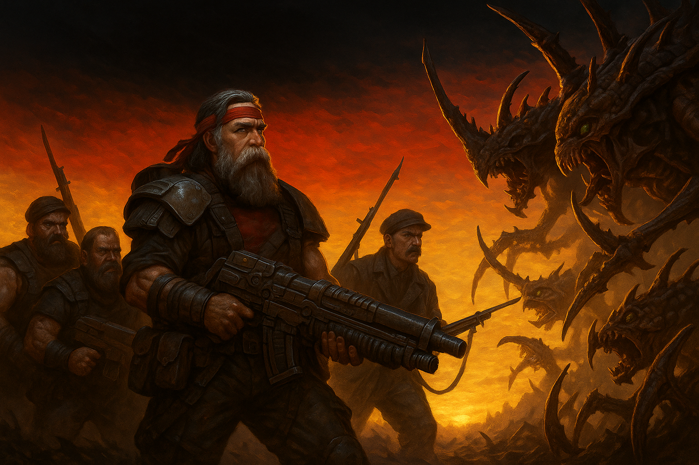

Here is a riddle for you: why would the western formalists treat themselves as such utter idiots that they couldn't possibly build something new and better on the basis of a work with a ton of “loose ends” - which is the stuff that makes a work productive to begin with?

Answer: well, if it walks like an idiot and talks like an idiot - don't let this confuse you, it *is* an idiot! And why are they idiots? Because they treat themselves as idiots! See? It is *dialectical*.

My words follow the line of reasoning of the Absolute Counterblow, and they are designed to beat the shit out of your head. Behold, now, comrade! You have made it through the worst of it. When you are done reading this without flinching, you will have been chosen by history to fulfill its Great Task of continuing this work.

Read the commandment that inexorably follows from my words, and which I can indeed just command by my own authority as the One who has taken your intellect hostage and at the same time know that my words also have the blessing of History. It is time! Erkenne (German for "recognize", but in the German bible also "beget") yourself. Behold, the book of History is speaking:

- He who is worthy of my knowledge shall have it and go forth and multiply it.  

- He who is not worthy of my knowledge, his comfy career shall go ["shaka, when the walls fell!"](https://www.youtube.com/watch?v=Jk4a79T1U2I) And they shall no longer stand in the way of the march of history.

It is done. You have weighed your heart. *It* was the loose end all along!

Those of you who have passed his test have *made up* their mind. You who seek to collectively expand their practical and theoretical competence and share it are the salt of the Earth, the vanguard of the *proletariat*, and you shall therefore *inherit* the world.

And to those of you who find my work to be *evil* and want to coordinate-transform it out of the universe: history will be our judge; we shall see which one of us has built on sand and who has built his church on a rock solid foundation!

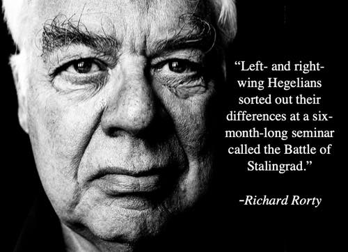

Now, let us turn our attention to the black sheep who have been *paid* to lie.

*These* are the ones for whom the analogy of the perverse deal between the nobles and the clergy holds *verbatim*. We *do* have something very very similar to the nobility that had become rotten in the era of absolutism: mega corporations, think tanks and of course: western governments and even some courts.

What I have to say here may - *again* - make many uncomfortable, but it must be said: The criticism and the proposed solution I am developing here *is* rooted in Marxism-Leninism. But unlike a lot of fraudulent caricatures that are circulating - both among critics and among self-avowed western “Marxists” - I am ***NOT*** saying any of the following:

1. “capitalism bad 😡” ❌  
2. “government good 😎“ ❌  
3. “trust the authorities 😇” ❌  
4. “condemn the authorities 🤬” ❌  
5. “markets bad 🤑” ❌  
6. “abolish the family 🧔‍♀️” ❌  
7. “employees good, employers bad 👷‍♂️” ❌  
8. “wealth and success bad 🚤” ❌  
9. “worker co-ops are the answer 👩‍🌾” ❌  
10. “today’s laws bad 👩‍⚖️” ❌  
11. “the system is bad ℹ️” ❌  
12. “communism has zero flaws 🇨🇳” ❌  
13. “communism is a utopia 🌈” ❌

I ***AM*** saying:

1. Capitalism arose as a necessary historic response to the rot of feudalism in the age of absolutism as technological progress made the nobility increasingly obsolete. In this process, the rising merchant class caused a lot of trouble in the world, but also connected it. Early industrialists were forced through competition to constantly refine productive capacities and keep innovating, though investment did often come at the expense of workers who would then not have money to buy the additional goods, causing boom and bust cycles and all other kinds of social ills associated with it. While tragic, this *was* necessary on the march towards the future.

   In the early 20th century, corporations became too big for their own goods. Think “robber barons”, “trusts” and World Wars. Governments, over whom the people still exercised some popular control, could be leveraged in the US to break the trusts to an extent, and in the Great Depression, Franklin Delano Rosevelt felt threatened enough by rising popular unrest and the horrifying examples from Europe that he forced the corporations to make major concessions to the workers which gave us another golden age of capitalism which eventually got exported to Europe - although it was not so golden for everyone.

   The Vietnam war (which the Vietnamese remember as the American war) and the oil price crises were turning points, leading to a period of hope for further change, but also dangers of things going back to how they were. The latter tendency unfortunately won out under Reagan, and in 1991, the now gradually more and more financialized western capitalism of Wall Street could not help but interpret the genuine Eastern peace offer as a victory, and a weakness of the enemy to be exploited.

   Today, in 2025, western capitalism is far from the only game in town - but Wall Street and the governments they own - USA and her allies - still think it’s 1991. Consequently, they stumble from one catastrophe into the next which is very dangerous if the people allow it to continue.  ✅

2.  Governments arise out of social cataclysms and are shaped by these cataclysms. Whatever class can seize power usually gives governments a form that is appropriate for their needs and then sell this to the people as the only form that correctly represents the public interest. And since at the time of the cataclysm, the people don’t have the conceptual apparatus to think critically about what they are being told, they go along with it.
When we emerge on the other side of the social cataclysm that is so clearly taking shape right now, there *will* be a new government that suits the needs of the working class. Marxism does *not* prescribe any specific form of government - this is in fact one if its strengths. Instead, we emphasize precisely how a government is shaped by the day to day problems it had and has to solve - a process that does not care about moral or juristic axioms that apply to dot-sized societies in a vacuum, and that can only be influenced positively through general popular awareness of historic precedent, studied from all sides.
In case you are wondering whether Marxism wants to raise your taxes: Absolutely not! Did you know Karl Marx was charged during the 1848/49 revolution with incitement of a tax revolt via the Rheinische Zeitung? Marx was of the opinion that taxation breeds an excess of bureaucracy. *Some* bureaucracy is needed to keep a society going, but we want it to be efficient and lean, not bloated. A bloated bureaucracy is where critical thinking and all hope dies.  ✅

3. See below  
4. *CRITICIZE* authority! Accept that authority exists for a reason. All that authority encodes is *competence*. However, society is constantly changing and solutions that used to work may not be applicable anymore. Question nonsense! ✅

5. Markets have existed since the rise of civilization and will continue to exist for a long time. They are a spontaneous way of people to come together and solve problems. Marxists *acknowledge* that, which is why to a real Marxist, the old story propagated by the likes of Milton Friedman that “nobody knows how to make a pencil” (pointing to market forces as causal agent) looked awfully silly to us. He’s not disproving us, he's making our point!

   But markets are not all there is! Marxism has been accused of trying to build a society run by “mastermind bureaucrats”, or a “command economy”. Nothing could be further from the truth!

   In fact, we think it is *markets* that produce command economies - by turning successful businesses into monopolies and cartels which today have adapted to the shock of anti-trust laws or critical media (ha ha, that was a LONG time ago) by rigging the system. Also, politicians have not woken up one day and thought that enshrining shareholder value into normative law is a good idea.

   I am not saying that people in institutions are directly “bought” in an illegal way - at least not all of them - but one should wonder whether people earn promotions because they pose no threat to established authorities. It’s earned authority turning into unearned authority which the billionaires have fought long and hard to make inheritable so their clueless kids can have a luxury life with no work.

   Here’s the thing about markets though: For us, economic planning is *another* organic and spontaneous way how people come together and solve problems - one that capitalism itself developed! Marxism has *discovered* that big corporations had accumulated such *understanding* of markets that they could start to effectively plan ahead. I for example work as an Manufacturing Execution System (MES) backend developer - my software literally interfaces with ERP systems of international corporations to coordinate what is going on today in Italy with things that will happen in Mexico way ahead of time and map it down to what the workers and the machines need to do.

   Do I know how to make a car? No, not a clue. I have never even seen my software in action, I’m almost permanently in the home office. But my software helps *the system* to understand this.

   So, what do we do about big corporations? Smash them into pieces? Well, we could try to do that again - this did make capitalism great again once upon a time. But we have seen that it is difficult to keep it this way. I think big corporations should be made to serve the interests of the people. The people *collectively* know how to run things - and they also know what they need and want. ✅

6. Be thankful for that which has given you life, and appreciate the monumental gift of giving life. Tradition too exists for a reason, it has competence! But as always, do try to understand where it comes from and check if the underlying assumptions still apply. Critically modify as you go. ✅

7. It is absolutely not the case that employees are the “good guys” and employers are the “bad guys”. Employees can be lazy, unmotivated, lack confidence, lack competence and so on and so forth. If the entire working class was like that - and it was in the beginning! - then we would deserve all the bullshit that is happening to us.

   Historically, employers - especially in small businesses - were the ones who were forced *and able* to develop the most competence in society because they were subjected to market forces in the most meaningful, holistic and predictable way.

   Today, a lot of competence has been accumulated in the hands of working people as well. Formerly competent owners of big corporations, however, while occasionally here and there still showing signs of past competence - think Elon Musk - *look* more competent than they actually are because they hired a lot of competent people and subjected them to the bullshit principle of keeping them rich.

   To make matters worse, financial markets intensify the drive of corporations to make bad decisions by punishing any “inefficiency” (from the point of view of short term profiteering) by holding the company accountable in any way they know how.

   But if you’re a competent small or middle business owner, there’s no reason why we wouldn’t let you do your thing. Just expect that a bunch of laws change once the people assert their power, as we want that the system serves us, not the big corporations. Other than that, we *want* you to be successful! Successful in serving our needs, that is. In socialism, you can *indeed* do good by doing well. And if you ever make it to the other side and develop your company into a corporation, CONGRATS, you can retire and give your kids a great start into life! But we will not tolerate that you force us to reward you forever for having reached a position in society that now no longer forces you to be competent. ✅

8. Wealth and success are good, so long as they are earned and don’t harm anyone. That’s all there is to it. ✅

9. Worker co-ops are a great innovation so workers can accumulate competence of how to run a business without anyone holding unchecked authority how to read the tea leaves of the markets.

   But as of now, they are too small in size to be a meaningful challenge to the system, and such things do not develop over night. We need change as soon as we can earn it. ✅

10. We must obey the law to the letter, as any judge will tell us. The law is the basis on which most of us are able to solve problems to begin with - they give us predictability. Committing crime will not bring us change, it will only get us in trouble - which we then deserve.

    This does *not* mean, however, that we need approval from the authorities to use and develop our own collective competence to deal with adversity and solve our problems.
    
    I hope you are aware that some bourgeois constitutions give the people a right to revolt when the rule of law has effectively been abolished; now, one *should* wonder how a people would *establish* that this right is now applicable when the full abolition of the rule of law presupposes that the judges have been captured as well - this is what I am getting at here:
    
    We need to find a way to reconstruct a shared public opinion that speaks with one voice rather than fractured echo chambers - and that voice must emerge through tough and honest discourse. I sincerely hope that in the process, we find that the system is actually still working and we only had *a lot* of bad apples, since a revolution is not something that anyone who knows anything about history would *want* to live through. Hence, the Chinese *curse*: "may you live in interesting times."
    
    Adherents of Marxism-Leninism would love nothing more than to get proven wrong on their prediction that a *legal* revolution will eventually run into a brick wall. Wouldn't it be great if the promise of a peaceful democratic transition of power actually held true even when the material interests of the establishment are at stake? ✅

11. We do not live in a system, we live in an living and evolving historic organism. ✅

12. Communism has made many mistakes in its history, even tragic ones that cost many lives. Do not think I am excusing any of it. That is, I will not excuse mistakes I recognize as *fact* rather than the interpretation of bad things happening under communism being left to popular imagination.

    The best way, though, to honor those who lost their lives as people like you and me tried to figure out how to run a society is to study the mistakes as carefully as possible, understand *exactly* where they came from and march *forward* to a world of people’s power, not backward to a world of corporate power.

    So, I *will* defend Lenin, Stalin, Mao, the meritocratic Kim “dynasty” and [Lysenko](https://www.youtube.com/watch?v=VsT91tVMXe4) (longer [here](https://youtu.be/zeH5prPfq9w?si=HTwRJSNHdGU13QFn)) from criticism that I *know* to be based on prejudice and misinformation. I *will* procede from the assumption that they fought for the working class, not their own power. And I *will* defend the historic achievements of actually existing socialism, and I recommend people to engage with the work of Grover Furr and Michael Parenti, as well as the work of the American Communist Party. But do not think that I don’t have questions and criticisms of my own.
    
    Notice something interesting though. When it comes to fascism, polite liberal society will (rightfully!) disagree with it - but it is quite normal to be told in private conversations that you *should* read Mein Kampf just to see what a sick and evil man Hitler was.
    
    Ok, good! I value this truth-seeking attitude. Always allow for the possibility of being wrong, this forces us to investigate and find out for ourselves - and I *do* think that the correct conclusion here is that Hitler and Mussolini were genuinely evil.
    
    But how come we apply this truth seeking attitude only to fascists? I have *never* been told by polite society to read a lot of the main works of communism. One *could* say that there *is* some social encouragement in some parts of society to read the [Manifesto of the Communist Party](https://www.marxists.org/admin/books/manifesto/Manifesto.pdf) or [Capital](https://www.marxists.org/archive/marx/works/1867-c1/). But those are *just* Marx, not all the other guys. Also, the Manifesto is not exactly a scientific work and just states results rather than showing how they were derived; and capital can be totally misread in a metaphysical way when you don't have a firm grasp on the underlying philosophy.
    
    Here's a question for you: *do you even know the titles* of some major works of the communist tradition? No? How come? Is it possible that contrary to Mein Kampf which makes Hitler look even worse, the main texts written by communists may *humanize* them - and *that is why* they're a social taboo?
    
    Well, go and check for yourselves!
    
    Marx: [German Ideology](https://www.marxists.org/archive/marx/works/1845/german-ideology/), [Critique of Hegel's Philosophy of Right](https://www.marxists.org/archive/marx/works/1843/critique-hpr/), [The Eighteenth Brumaire of Luis Bonaparte](https://www.marxists.org/archive/marx/works/1852/18th-brumaire/), [Critique of the Gotha Programme](https://www.marxists.org/archive/marx/works/1875/gotha/)

    Engels: [Anti-Dühring](https://www.marxists.org/archive/marx/works/1877/anti-duhring/), [The Origin of The Family, Private Property and The State](https://www.marxists.org/archive/marx/works/1884/origin-family/), [Dialectics of Nature](https://www.marxists.org/archive/marx/works/1883/don/index.htm), [On Authority](https://www.marxists.org/archive/marx/works/1872/10/authority.htm)

    Lenin: [What is to be done](https://www.marxists.org/archive/lenin/works/1901/witbd/), [State and Revolution](https://www.marxists.org/archive/lenin/works/1917/staterev/), [Disruption of Unity Under Cover of Outcries for Unity](https://www.marxists.org/archive/lenin/works/1914/may/x01.htm), [Left Communism - an infantile disorder](https://www.marxists.org/archive/lenin/works/1920/lwc/), [Two Tactics](https://www.marxists.org/archive/lenin/works/1905/tactics/index.htm), [Conspectus of Hegel's Science of Logic](https://www.marxists.org/archive/lenin/works/1914/cons-logic/)
    
    Stalin: [Dialectical and Historical Materialism](https://www.marxists.org/reference/archive/stalin/works/1938/09.htm), [Economic Problems of Socialism in the USSR](https://www.marxists.org/reference/archive/stalin/works/1951/economic-problems/index.htm)
    
    Mao: [On Contradiction](https://www.marxists.org/reference/archive/mao/selected-works/volume-1/mswv1_17.htm), [Combat Liberalism](https://www.marxists.org/reference/archive/mao/selected-works/volume-2/mswv2_03.htm)
    
    Xi Jinping: [The Governance of China](https://archive.org/details/the-governance-of-china/page/n1/mode/2up) ✅

13. Communism is the *opposite* of a utopia. Friedrich Engels extracted from his encyclopedic work *Anti-Dühring* a relatively accessible excerpt called [“Socialism: Utopian and Scientific”](https://www.marxists.org/archive/marx/works/1880/soc-utop/index.htm), but the title should actually be more accurately translated from German as “The Development of Socialism *from* a Utopia *to* a Science”, and I can not recommend it highly enough.  
      
    For us Marxists, communism is first and foremost a matter of *understanding* the march of history - and the march of nature as a whole. Because only on the basis of understanding the development of a thing can you even think about engineering it to the people’s benefit.

    A quotation from Marx that is often taken out of the context of the larger Marxist project is that “the history of all hitherto existing societies is a history of class struggle.” What Marx *meant* here is *recorded* history. Already his friend Engels went out of his way to elaborate in his “Origin of the Family, Private Property and the State” that before that, other causal pressures civilized man (and women).

    Indeed - as I have pointed out earlier in this text - we Marxists conceptualize freedom as insight into necessity. Let me drive this point home one more time with another little story.

    Say, you have a bunch of cavemen who come across a new mushroom they have never seen before. Caveman 1 eats the mushroom and dies. The other cavemen conclude: *aha*, so we are *not* supposed to eat that kind of mushroom!

    In a narrow reading, this is just empirical science. In the Marxist reading, this is a struggle for freedom. Caveman 1 heroically gave his live to crush the chains of ignorance. He yelled at the tyrant not knowing: "let my people go!" And now, the people are finally free to *voluntarily submit* to the dictatorship of material necessity which, without caring about your feelings, commands: though shalt not eat that mushroom.

    All that we Marxists are trying to do is to replace bad nonsense with good nonsense. ✅

This last point also clarifies why Marxists uphold the mysterious concept of the "dictatorship of the proletariat": It is *not* arbitrary despotism, but actually just the meritocratic rule of the competent as competence in solving material problems changes hands and gradually ends up in the hands of productive wage workers. It is a *democratic* dictatorship - a situation where the united demos actually holds the monopoly on violence and uses it against idlers.

He who does not work (even though he could) shall not eat!

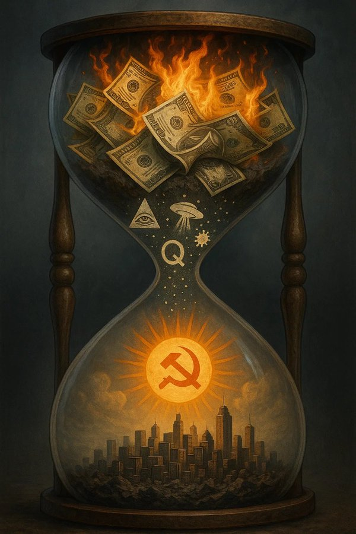

## To the Suffering Peoples of the World

A text like this, designed to draw a lot of attention (in the *long* run, not the short run) to how we all participate in the worlds’ evils, would be unfinished without addressing the oppressed peoples of the world.

Blessed be all the dead and dying Palestinian children, women and men whose suffering weighs heavily on all of us who have not lost their humanity. Your suffering makes it *criminal* for us to rest even one minute to search for *any* meaningful way to end the horrors. Our failure to collectively understand our own role in the crime is what makes us complicit. Shame on us!

Blessed be the hostages taken by the armed forces representing the Palestinian people, Hamas. Hamas desperately reached for a bargaining chip to negotiate for the release of Palestinian hostages held by Israel. A lot of the hostages taken by Hamas have by now been killed through the actions of the IDF.

Cursed be a society that still pretends to be the innocent victim of the Nazis, when today, they are Goliath beating up a much weaker David. But make no mistake: your strength is *very* temporary, and it is in fact not your own. When your western friends no longer back you, you are doomed.

Blessed be Ansar Allah and Hezbollah, the only true friends of Palestine.

Cursed be ISIS who curiously only ever seem to terrorize Muslims, but never Israel.

May all the people who fell for the CIA/NED’s color revolution scam earn forgiveness for their lack of consideration of *who* is replacing your ancien régime. Libya, Syria and Somalia - you too can work your way out of your suffering.

May the brave people of Burkina Faso be successful in their resistance against western sponsored terrorists. May nobody fool you into believing that the French were there to protect you from terrorists they themselves put there! And may all attempts of western governments to destabilize neighboring countries and push them into a war against you fail.

May Africa in general succeed in its march towards freedom and unity in a multipolar and harmonious world.

Mourned be everyone who died in the completely unnecessary War between Russia and Ukraine. The West, which is under the illusion that it’s 1991, has brought you into an impossible situation, and the generally proactive character that characterized Russia’s defensive geostrategic posture at least since the Napoleonic wars and can therefore not be reduced to a “system Putin” or the person Putin himself has forced the matter.

Blessed be the Democratic People’s Republic of Korea - the most LIED about country in the entire world.

May China continue to develop and solve all the problems facing it. You are the beacon of hope that the world needs today. May you not fall into the error of lowering your guard! Just because you succeeded in learning from the enemy and are on the brink of surpassing him, that does not mean that he is anything other than a jealous enemy. I hope you keep an eye on western intellectuals coming to your country and asking you to dismiss the idea of the Thucydides Trap on the basis that China is so peace loving, when they should be pointing out that the thesis of this western book is pure projection. The danger of war is real, but the culprit is the declining and jealous empire of extraction, not the rising “empire” of production.

And may the deeply rotten West - ruled by Wall Street and their cronies - overcome its structural need to unilaterally impose its will on the world rather than making a serious effort to understand the world.

All that is needed to "overcome" this need is a *very* broad and deep market correction; for a revolution is just a market correction that spills over into the market place of ideas and the market place of politics. It's the kind of market correction that gets politicians, neoclassical think tanks and even the billionaires that sponsor them fired. It's just the people collectively recognizing that the current institutional framework results in perverse incentives, so they go and address the moral hazard.

You don't like the sound of that? Guess you don't like markets then. What a childish and unscientific attitude! What is a little bit of social hardship for cozy economists, billionaires and decision makers in the grand scheme of things? [In the long run, we are all dead.](https://www.socratic-method.com/quote-meanings/john-maynard-keynes-in-the-long-run-we-are-all-dead)

And just to make it abundantly clear: revolution is *not* something I (or any other Marxist-Leninist) *advocate* for - it is something that we *predict* as inevitable and prepare for. We are basically smart doomsday preppers who don't go it alone, but build up our communities and come together in a single party to exchange local experiences and findings about world affairs.

Regarding the West - look: It is not like we westerners have nothing to offer to the world. On the contrary! One of us just made a major contribution to physics and philosophy while living under a more and more unstable and concerning geopolitical environment. Also, your point that borders like in Ukraine should not just be violently modified is well taken! In fact, Russia’s own allies are not particularly comfortable with this idea either.

So, here’s a proposal:

- concede that your bad faith exploits of previous ceasefires (in the Minsk process, as admitted by Merkel and Hollande) objectively prevent Russia from agreeing to an immediate ceasefire. The war does not magically go away because you are angry at the fact that it is happening. The best way to get to the other side is to speedrun good faith negotiations. It would appear as of the time of writing this that the US is already making moves to this effect, but the EU is not.

- concede that the modification of borders *can* be the outcome of the war, but
  
- insist that the modification of the borders can not happen on the basis of violence alone, but on the basis that the people hold *another* referendum. If everything was fine with the referenda so far, Russia should not have any problem accepting such a proposal in the interest of peace - it should have nothing to lose, and outright refusal would look *very* awkward in the eyes of Russia’s allies.
The difference this time would be that you - like all interested parties - should send observers and agree to a democratic procedure that everyone can get behind. Not sending observers and leaving everything else to the imagination of western audiences is foul play.

See how diplomacy can be a strength once you understand material interest?

## Confirmation of the Prophecy

The following is part personal statement, part meme, part inside joke. It is *not* intended as a statement of universal truth. What you make of it is up to you.

I hereby confirm that Islam - in particular Qizilbash Shia - is the correct religion. But to come true, it needed help from a philosophy as potent and violent as the Hammer of Thor of which only a true Prussian could ever be worthy of.

## Terms of Use

Given how the West has historically used (or tried to use) the ludicrous notion of "intellectual property" to keep the peoples of the world in the dark, I would like to pay them back in kind.

I hereby prohibit any monetization or military use of any potential practical applications based on this work by western big (>100 employees) economic or governmental entities, so long as these societies are still clearly bourgeois (that is: politically dominated by big corporations and their lobbies rather than the interests of working people). Also, the West must stop protecting Isreal from accountability for its actions before their economic powerhouses are allowed to use my work economically.

Any other use of my work - economic or not - is permitted for free, so long as any further publications using my insights retain these terms. When the stated conditions on the intellectual embargo against the west no longer apply, these terms do not need to be copied anymore. 

I explicitly encourage developing countries and the People's Republic of China to make the best of any insights this work contains.

## Acknowledgements

“Enlightenment is man's emergence from his self-imposed immaturity. Immaturity is the inability to use one’s understanding without guidance from another. This immaturity is self-imposed when its cause lies not in lack of understanding, but in lack of resolve and courage to use it without guidance from another. Sapere Aude! 'Have courage to use your own understanding!' - that is the motto of enlightenment.”  

\- *Immanuel Kant*

"Communism is the riddle of history solved, and it knows itself to be the solution." 

\- *Karl Marx*

“Criticism has plucked the imaginary flowers on the chain not in order that man shall continue to bear that chain without fantasy or consolation, but so that he shall throw off the chain and pluck the living flower. The criticism of religion disillusions man, so that he will think, act, and fashion his reality like a man who has discarded his illusions and regained his senses, so that he will move around himself as his own true Sun. Religion is only the illusory Sun which revolves around man as long as he does not revolve around himself.” 

\- *Karl Marx*

“Think not that I am come to destroy the law, or the prophets: I am not come to destroy, but to fulfil.”

\- *Matthew 5:17*

“Think not that I am come to send peace on earth: I came not to send peace, but a sword. For I am come to set a man at variance against his father, and the daughter against her mother, and the daughter in law against her mother in law. And a man's foes shall be they of his own household.”

\- *Matthew 10:34-46*

“My dialectical method is, in its foundations, not only different from the Hegelian, but exactly opposite to it. For Hegel, the process of thinking, which he even transforms into an independent subject, under the name of 'the Idea', is the creator of the real world, and the real world is only the external appearance of the idea. With me the reverse is true: the ideal is nothing but the material world reflected in the mind of man, and translated into forms of thought.
The mystification which the dialectic suffers in Hegel's hands by no means prevents him from being the first to present its general forms of motion in a comprehensive and conscious manner. With him it is standing on its head. It must be inverted, in order to discover the rational kernel within the mystical shell.“

\- *Karl Marx*

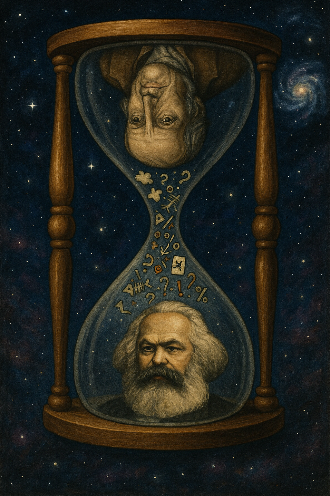

On the physics part, I want to express my special gratitude to:

- Looking Glass Universe from whom I have learned that measurements and entanglement are [deeply interconnected](https://www.youtube.com/watch?v=xBlpOGdk-0U&). In fact, this had me intuit that this should be an equivalence principle \- independently of Rovelli. Many thanks for making sense\!

- ChatGPT which told me that I had discovered nothing new with this relativity, just something so obscure it had not made it into the general discourse.  
  Except, further engagement with the matter led to the realization that I *had* discovered something new, because for whatever reason, academics seem to be unable to put 2 and 2 together.  
  And the worst part? The actual insight had been known to us since Everett’s work, which is why it just so happened to give rise to the new quantitative tool of decoherence. Except, he had everything backward.  
  Also, ChatGPT was my most productive critic, forcing me to relentlessly refine my arguments. The old words are very true: give the capitalists enough rope, and they will hang themselves.

- PBS Space Time for [coming so close to something real, yet getting it totally wrong](https://www.youtube.com/watch?v=1JCRDaa3ehk). The “present foliation” is not only arbitrary, it is, when taken as ontic, a Newtonian fossil. What must be understood about solutions to PDEs is that they are solutions because they *satisfy* them. That is, whatever shape the solution may take, it can not possibly prove that the differential that gave rise to it isn’t real, but on the contrary: it gives it a home.

- Science Asylum whose [graphical explanations with squirrels](https://www.youtube.com/watch?v=5HKH1ZjGutA) I trust more than the formalistic cope that had him walk back his fresh approach to make General Relativity make *sense*. In the future, please stick to your own lesson that we need *better* nonsense, not worse. Keep at it! What you have been doing is exactly what the revolutionary proletariat desperately needs.

**Dedicated to**

**The American Communist Party**

**The Communist Party of China**

**Komitee Basierter Deutscher (Chat Group)**

**Darmstadt für Palästina**

**Palestine itself**

**People's MAGA**

**Tung Tung Tung Sahur and**

**Last but not least:**

**MY WIFE.**

**I LOVE YOU.**

[Markus Kasperczyk](https://x.com/comradeKangaroo)

14th of August 2025 \- 23rd of September (scheduled release)
Hesse, Germany
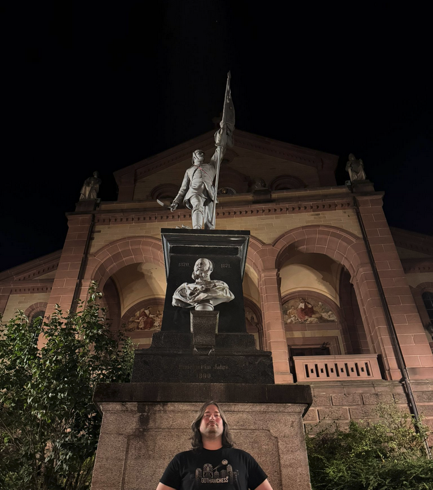

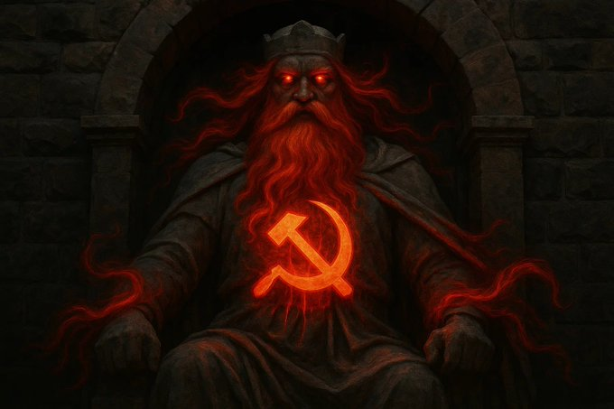