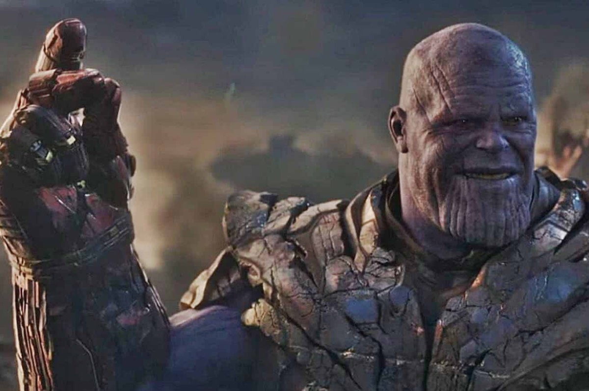
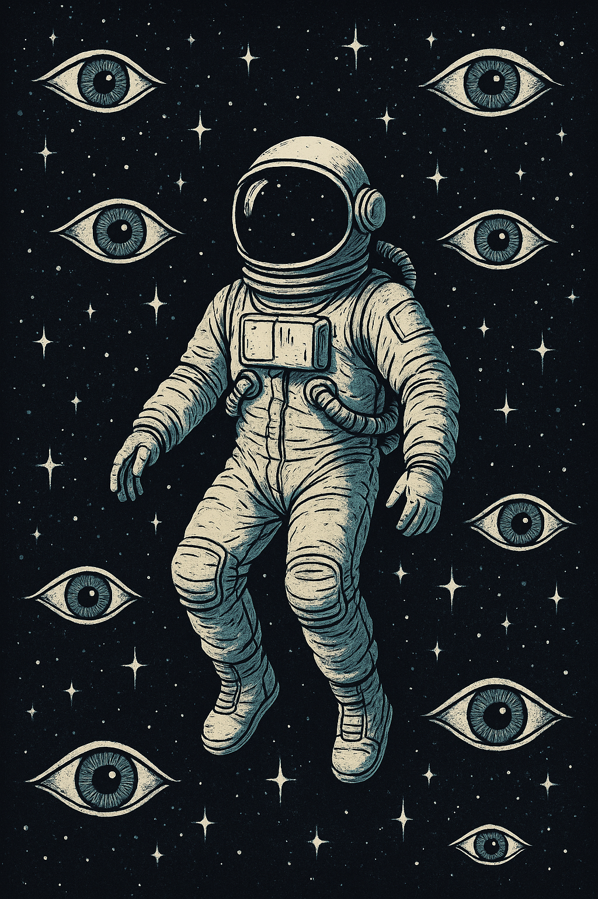
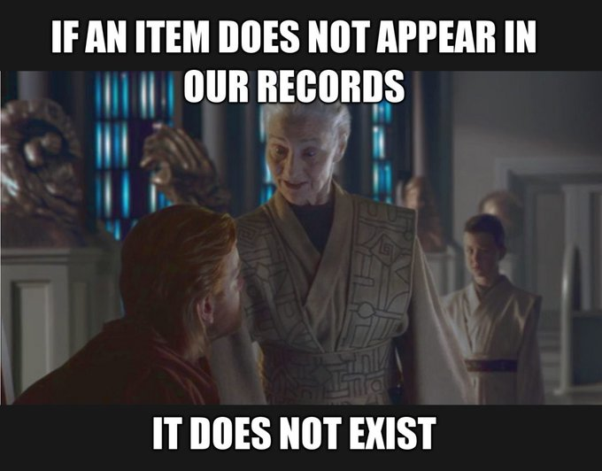
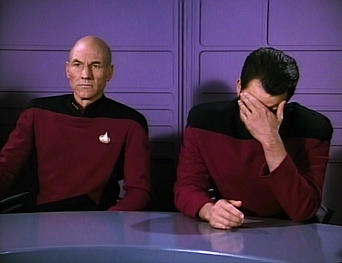
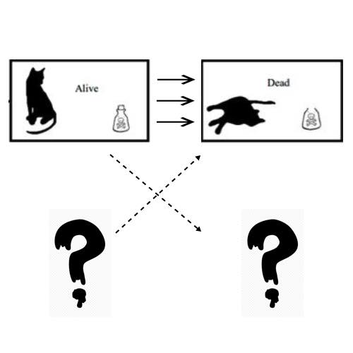
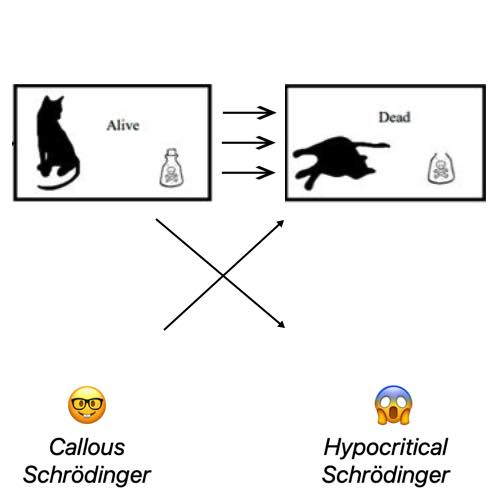
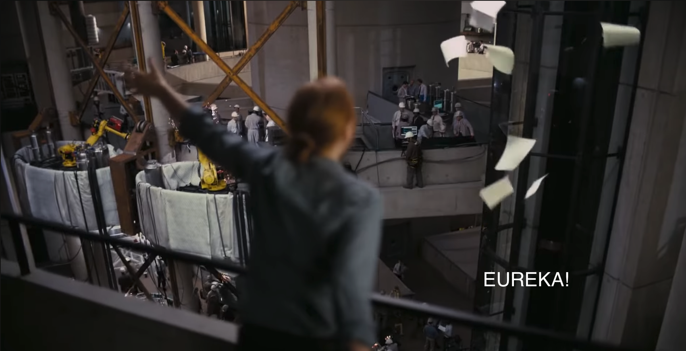
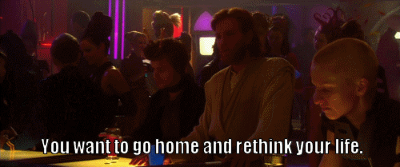
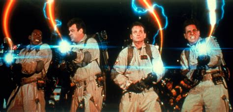
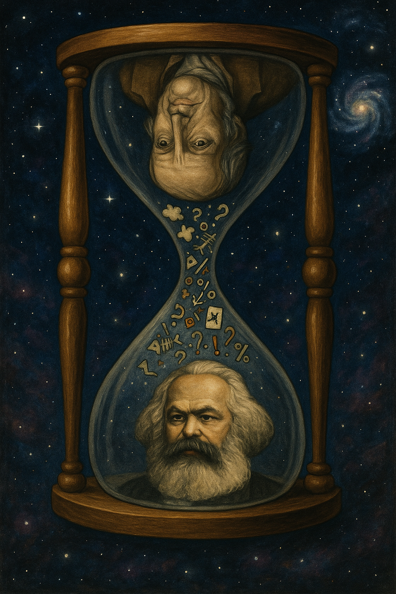

# The Galilean Moment of Quantum Mechanics

!!! Attention: This work is still in refinement stage until 23rd or September 2025. After this, I hope I can limit myself to minor revisions and pointers to other contributions. Until then, everything you read is provisional.

## Abstract

In this publication, I will discuss Carlo Rovelli's Relational Quantum Mechanics (RQM) and how it aims at resolving the measurement problem. Once I have explained how I think it works, I will point out an obvious type of criticism and how Rovelli tried to fix the problem. After this, I will show why it does not fix the issues, suggest a *much* better fix. In the section "Road to Formalization", starting from a simple change in notation that I recognized only later as novel and clarifying, I develop how some of this plays out mathematically.

## Table of Contents

- [The Galilean Moment of Quantum Mechanics](#the-galilean-moment-of-quantum-mechanics)
  - [Abstract](#abstract)
  - [Table of Contents](#table-of-contents)
  - [Note](#note)
  - [Back to Materialism!](#back-to-materialism)
      - [Wigner's Friend: A Thought Experiment](#wigners-friend-a-thought-experiment)
      - [Fixing Rovelli](#fixing-rovelli)
      - [Summary of my Two Postulates](#summary-of-my-two-postulates)
  - [Road To Formalization](#road-to-formalization)
      - [The Wrong and the Right Question](#the-wrong-and-the-right-question)
      - [The Math](#the-math)
        - [History](#history)
        - [Unitary/Markov Analogy](#unitarymarkov-analogy)
        - [Markovian Example](#markovian-example)
        - [Markovian versus Unitary Modelling](#markovian-versus-unitary-modelling)
        - [Probabilities](#probabilities)
      - [Why Does This Not Break Things?](#why-does-this-not-break-things)
      - [The Big Picture](#the-big-picture)
      - [Research Directions](#research-directions)
  - [Some More Philosophical Consequences](#some-more-philosophical-consequences)
  - [Acknowledgements](#acknowledgements)

## Note

You are reading the version of this paper that is optimized for western academic philosophers of nature. A version taking a more interdisciplinary approach can be found [here](https://github.com/GermanBrainRot/Project-Galileo).

## Back to Materialism!

In [1996/97, Carlo Rovelli](https://arxiv.org/pdf/quant-ph/9609002) introduced the idea that descriptions of quantum systems could be observer-dependent. Here, "observer" does not refer to any "conscious" or "macroscopic" entity, but returns to the more sober and naturalistic meaning that the term used to have in physics prior to Quantum Mechanics - and which it still has in Special and General Relativity.

To motivate the idea of observer-dependence, he proposed a thought experiment which has since been [pointed out](https://arxiv.org/pdf/1710.07556) to be a restatement of the old thought experiment of Wigner's Friend. For the sake of clarity, I will therefore motivate Rovelli's idea starting from Wigner's Friend.

#### Wigner's Friend: A Thought Experiment

Eugene Wigner, like many physicists, once wondered what exactly constituted a measurement and what the mysterious "collapse of the wave function" during a measurement might mean.

For him, the collapse had to have something to do with quantum systems interacting with consciousness. Here's how he justified this:

Suppose, instead of Wigner himself conducting a quantum measurement, he would have a friend conduct the measurement. Wigner himself would stand outside of the lab. So far, so good.

Now, after the measurement, Wigner's friend comes out of the lab and is asked by Wigner about the outcome of the experiment. Notice something here: *from Wigner's point of view*, if quantum mechanics is correct, the answer must at this point be described using a superposition between the different possible outcomes. It is only upon hearing (i.e. "measuring") the answer that Wigner's description can collapse to a single state.

So, does this mean that Wigner's friend was in a superposition until that point as well? Well, let's find out! Wigner asks his friend: "what did it feel like to be in a superposition?" His friend looks confused, then replies: "What do you mean? I was not in a superposition!"

And this leads Wigner to the "only" correct interpretation: consciousness collapses wave functions! -

Yeah, except that this is obvious nonsense and has since been challanged in various ways. Today's consensus seems to be that it's not about consciousness, but about interactions with macroscopic environments which "decohere" into a single classical reality (more on this idea later).

In his key contribution, Rovelli added his own unique take: What if Wigner's friend truly *is* in a superposition - *for* Wigner? Yes, you read this right: Rovelli's solution boils down to stating that superposition for me can be facts for thee and vice versa.

In particular, this means that for Rovelli, the wave function is epistemic: it's just a book keeping tool to account for the state of systems that you have not interacted with yet.

You know what? This is actually a genius idea! I am *not* being sarcastic here. It's the *exact* type of idea that got us from Newtonian physics plus weird Lorentz transformations to account for the constancy of the speed of light for any observer to Einstein's relativity - and Rovelli is bold enough to draw this comparison himself in his initial paper.

Except, it doesn't quite work. Here's the problem:

If something can be a fact for one party (say, Alice), in limbo for another party (say, Bob) and once again a fact for a third party (say Charlie), who or what guarantees that Alice's and Charlie's facts agree once Bob learns of Alice's and Bob's notes?

Well, an [ad-hoc postulate](https://philsci-archive.pitt.edu/20379/1/RQM%20paper%20copy.pdf) does. After a quarter of a century, this rather obvious weak point had become bothersome enough that Mr Rovelli felt the need to just assert that this should work.

The way he attempts this is not without merits. At least, it hints at an ontology that could be responsible for this to work: each observer just carries the information about their measurement records around in some way, for example in correlations between observables. Nice! We avoid hidden variables simply by using *statistical correlations themselves* as the locus of physical information. Very elegant move!

But somehow, this is still quite slippery. Rovelli's idea how all this fits together forces him to write something like this:

*This postulate implies that the information stored in Alice’s physical variables about the variable V of the system S is accessible in principle to any observer who measures her in the right basis, so at least at an emergent level this information about V is an observer-independent fact.*

Excuse me? What if I measure her in the wrong basis? Is the information forever inaccessible to me? What does measuring "someone" in the wrong basis even mean?

Honestly, this sounds like Rovelli's interpretation slips right back into some version of Many Worlds - a criticism that he has been struggling with from the start. And indeed, the "fix" for this is to be found in the exact same place as with Many Worlds, as the "at an emergent level" part of the sentence I quoted gives away:

*It is clear that decoherence should play some role in this story. And in fact, decoherence provides exactly what it needed here: it picks out a basis which is dynamically favoured and then disseminates information stored in that basis through the environment.*

Mr Rovelli, didn't you want to treat the wave function as a book keeping tool rather than something physical? So, what is it that "decoheres" here? Certainly not quantum branches, right? How can a set of systems "decohere" into a single reality - unless you basically allow an ontic wave function and even Everettian branching again?

Alright, and *this* seems to be the state of the art here! At least as far as I am concerned, the mysteries have not *quite* gone away. If we invoke decoherence to explain the "emergence" of stable facts at the macroscopic level, we would have to say *what* decoheres. So, back to the drawing board!

#### Fixing Rovelli

What if we went a little further than Rovelli and simply treated facts as facts? That is: *measurement bases be damned*, once an interaction happened, *it is a fact*.

But hold on! Is this not in a direct contradiction with the idea that facticity or superposition should be *relative* to an observer, that is, *observer-dependent*? How can an interaction that happened *just be a fact* when *at the same time* we require that another observer who doesn't know about the interaction record yet could somehow still *validly* describe the situation as a superposition?

The answer is actually somewhat obvious once you read it. It is *so* obvious that I couldn't *believe* that it hadn't occurred to anyone for a quarter of a century - at least to my knowledge.

Mr Rovelli, was your theory not supposed to make Quantum Mechanics *directly* compatible with Special Relativity? In Special Relativity, whether an event has happened or not is *relative* to the observer! Just because the interaction already resides in the causal past of Wigner's friend, this does not mean that it is already in Wigner's causal past!

For the casual reader who might be confused about this, you can find a nice explanation how the speed of light is related to causality [here](https://www.youtube.com/watch?v=msVuCEs8Ydo) and how relativity of simultaneity (within a discussion of relativistic length contraction) [here](https://www.youtube.com/watch?v=TxW6_E3uLuo).

The above insight leads to a *natural* refinement of RQM. It is *not* an ad-hoc axiom or postulate, it is *well motivated* by known physics:

**Interaction records are factual for any pair of observers such that the interaction resides in the intersection of their causal past.**

If we simply dump everything we consider a definite fact into the shared causal past of all the observers for whom we require agreement, these facts can simply not bother any other observer; for there are only two other types of observers:

- Those who can never interact with the fact because, for example, they have fallen into a black hole  
- Those for whom the fact lives in the future and for whom the wave function is the absolute horizon

Once we make this adjustment - which is *squarely justified* by our current secure knowledge of the universe (but needs to be handled with a little more care later) - a lot of things suddenly make sense.

Let us now take a walk through the freak show of Quantum Mechanics like Thanos would because ... we kinda can:

**Schrödinger's Cat** - dead and alive, but what people forget to mention *even though basic relativistic common sense screams it in their face* is that learning about the live/dead state of the cat *implies* learning about whether the atom has decayed that would trigger the mechanism that would kill the cat. That is all that entanglement encodes! Information about an interaction entering your causal past means that an *entire consistent causal history* enters your causal past. If we position the experiment in such a way that the trigger is behind the cat from our perspective, the information about the entire sequence of events enters our causal past all at once.

**Retrocausality** - This one doesn't even need any special interpretation to be [thoroughly debunked](https://www.youtube.com/watch?v=RQv5CVELG3U), but I think the ontology we are building towards here suggests that Quantum Mechanics actually yells at us precisely that retrocausality is *not* real.

Think about it: when we see an interference pattern on the screen behind a double slit, isn't this precisely the universe telling us that it *can not* retroactively *create* the information through which slit the particle has gone? Because, if we were to see two peaks rather than an interference pattern, this *would be* nature coming up with a so far non-existant history on the spot. Once the particle has definitely made it past the double slit without being constrained to go either through the left slit or the right slit, we have condemned the particle's position *at this time* to be in a superposition for all eternity and that's all there is to it. It can have a position later if we measure it, but whatever we measure must be consistent with the particle *not* having had a definite position when it went through the double slit.

**Decoherence** - hitherto, it was assigned the role of Descartes' Demon who modern science has demoted from an intellectual tool to *criticize* our own bullshit to an underpaid lab assistant tasked with *justifying* the bullshit: The other branches are still there, we're just extremely isolated from them; *Therefore* (!), our inability to see other quantum branches is just our senses playing tricks on us.

But why should we evolve a consciousness so poorly suited to perceive actual reality? Suppose, the dinosaurs had survived on some other such “quantum branch” and were at the brink of developing the ability to perceive those hidden dimensions. Being eaten by an interdimensional T-Rex is quite a terrifying thought!  

Luckily, it is not real.  

All that decoherence does is to quantify to what degree small things enter into fewer relationships than big things, therefore revealing less about themselves to the universe than big things do. It estimates and quantifies the *“relationship density”* of a thing: for an individual particle, *it is perfectly fine* not to go through the left or the right slit at the double slit *because* it has so many ways *not to* interact with the world.

Think of it this way: if I was moving through outer space, I would always (in principle) be able to know where I am because I can triangulate my position relative to distant stars. We macroscopic entities live in an Argus universe, a quantum panopticon.

An electron, on the other hand, is not able to do that, because it is so small that the photons have a good chance to miss it. And then, *there is no fact of the matter*.

More philosophically: decoherence is “Hegel's Law” (“quantitative change [here: system size] leads to qualitative change [here: weird absence of facts vs classical facticity]”) of quantum mechanics.

**The Block Universe** - This one also doesn't really need a new interpretation of QM to be debunked, as it arises more out of General Relativity than Quantum Mechanics; the simplest criticism is that solutions to Einstein's field equations are solutions because they *satisfy* the field equations, thereby giving all observers (i.e. infinitesimal regions that experience a flow of time) a way to coexist even though that appears contradictory from a Euclidean/Newtonian point of view.

Still: if - as my observation suggests - the past is full of facts and the future *actually has not happened yet* for us, that makes the whole notion of the block universe even more sus. Also, just because you have a closed form solution that you can traverse forward and backward in whatever way you like doesn't mean that this is physical. Moreover, closed form solutions fail to exist even in simple cases as the Newtonian (!) general three body problem, so you're taking comfort in the false promise of knowledge when *you know* you don't have access to that nebulous Platonic ideal.

**Superdeterminism** - It depends on what you *mean* by it.

If you take it to mean that there are any laws that allow you to *predict* future events that are insufficiently constrained by facts inscribed into your causal past, I wish you good luck but I do not hold my breath.  

If you take it to mean that you can, in thought, place yourself at the heavens of the "end of all world lines", I will admit that this works, but *you just made that position up*, and the minute you forget that, you condemn your future self to wrestle with the same kind of nonsense that we are wrestling with in the present.

**Counterfactual indefiniteness** - Star Wars already knew the answer:  

If an item does not appear in our records, it does not exist. 

Or to be more precise: What is *factual* is the record of the interaction, that is, the concrete values that observables took when interacting with each other (=measurement). The wave function is needed as an epistemic excess over the facts to explain their further development, making it at the same time ontic.

Now, you will say that this is contradictory bullshit, but if you do say that, I'm about to make you eat your words because there's *another* refinement we need to make to Rovelli's interpretation.

---

Rovelli's main point is that world descriptions should be *relative* to the observer. Rovelli himself then correctly concludes from this that the observer is *part* of the universe and we can not describe the universe "from nowhere in particular".

Very good, Mr Rovelli! (Again, if this sounds ironic or sarcastic, I apologize - I think this is genuinely good). But how to operationalize this? Alas, Rovelli is a little shy here. He assumes that Quantum Mechanics is basically complete, so we can just use its formal apparatus and maybe derive it from an axiomatic basis that makes sense. The best we get is some notation indicating that we are looking at a world description from a given perspective. That is a little disappointing.

**Alright, let's give it a shot then!**

Let us start with a simple observation: in everyday language, relativity "removes" facts. This is, I think, the trap that Rovelli has fallen into. What relativity *actually* does is that it *refines* our notion of what counts as a fact.

In mathematics, this is well known. It is the reason why we pin objects down "up to isomorphism" and work out properties that are invariant under these isomorphisms. In category theory, this concept is known as "universal properties". And in theoretical physics, there is a notion of "gauge invariance" that is related to this.

In the narrow sense, a gauge (here: Yang-Mills gauge) can be thought of as a set of symmetries so that contributions to interactions are redundant and naively summing them all up would over-count. It's basically a very fancy dx in an integral.

In a broader sense though, we come right back to the familiar notion from pure mathematics: if we know how spacetime works, we can change our coordinates - and whatever changes we observe through such a move, we would not interpret them as a change of the physical *facts*. That is: what is a fact is that which is left invariant under all admissible perspective changes.

Alright, let's do this for Quantum Mechanics then!

If I am a measurement aparatus, what is measurement *about* from my perspective? Fundamentally, it is about *other* quantum objects, *not* about me. I can not see myself directly! I *can* see what *other* objects are doing, but I must infer anything about myself from observations of the rest of the world. Whatever we do: to get a *complete* picture of reality, we must try to learn not only about the outside world, but also about ourselves and our causal impact *by using the universe as a mirror*.

This suggests that we have to restrict what we mean by "fact" to anything that is true from the point of view of any observer *as we leave this observer out of the picture*.

Here, it also becomes a bit clearer what an "observer" could even be. In essence, it's a set of correlated observables moving from one interaction to the next one. In general, such a "causal principle" can branch apart: just because the N observables all participated in one interaction, this doesn't mean that all N of them will participate in the next interaction - this should actually be more of an exception in general. But under certain circumstances, we end up with self-reinforcing interactions so we can treat all the involved observables as one very complex "macroscopic" observable.

Oh, and by the way: in case you didn't notice it, I have answered in what way the wave function is *both* epistemic *and* ontic at the same time now. Which by the way also answers why it seems to difficult to commit to either stance.

Pause here if you need another minute.

Ready?

Well, if the observer lives *inside* the universe, then *his* epistemic wave function through which he understands the past and predicts the future *must be physical*.

#### Summary of my Two Postulates

Let me repeat my two postulates again for clarity.

1. Real facts live in the causal past that any set of given observers share in common; that is: they live in the intersection of their past light cones. Access to those facts is granted through interactions, and consistency becomes possible because facts are just facts.

2. Whatever counts as physically real must be invariant under perspective changes between different quantum observers which I take to mean any maximal set of correlated observables that participate in two successive interactions that matter to the dynamics we try to describe. This includes facts about particles at a given time that have been revealed through interactions (and that would not have meaning outside of the context of an interaction); but what is real *also* includes the wave function associated to each observer which *for them* can be interpreted as the epistemic connective between past and future - the substrate of cause and effect. A *perspective* is a description of the world that "leaves the observer out of the picture", that is, the observer is a set of *hidden variables* that he can only know about via inference over the outside world.

With all of this, [Bell’s beables](https://arxiv.org/pdf/2305.16194) become *becomables* which live at the same time at the point of an interaction *and* in the onto-epistemic wave functions growing out of interactions.

Let's see how this plays out!

---

Let us have a look at what my second postulate does for the Schrödinger’s cat thought experiment.

 
It is *here* that we see most clearly (without formalizing it yet) what my second postulate *means*. Herr Schrödinger keeps checking in on the cat, say, every 30 minutes to see if the cat is still alive or not - until it is dead. But Herr Schrödinger can *only* observe the cat and the quantum contraption that will eventually kill the cat. He can *not* directly observe himself - yet he knows that he is somehow part of the story.
It is a *riddle*: Herr Schrödinger's task is not only to find out whether the cat is dead and alive; in order to understand the experiment *in its entirety*, he has to come to an understanding *about his own role* in the experiment. And since he can not see himself, he has to infer his own causal impact on the situation *by observing how the situation unfolds*. The situation becomes a *mirror* for him.
So, how do we have to complete this causal picture so it makes sense?

It’s *YOU*, Herr Schrödinger! Yes, you.

YOU killed the cat. Just because you put the knife into the hands of the Brutus that is the Cesium atom, this does not absolve you from your causal contribution. Saying “the Cesium atom’s decay caused the cat’s death, I didn’t make it decay!” is a CHEAP way out of your responsibility. YOU sick sadistic freak set the thought experiment up in such a way that the cat would *have to* die - the only thing you gave out of your hand was the information about when it would happen.

---

It would appear that we can now make sense of the wave function even at the macroscopic scale. The difference between quantum and macroscopic scales is indeed the extent to which facts are established through a gigantic web of interactions.

Let me point this out with another example.

If you saw a snapshot of a[ tea pot in space](https://en.wikipedia.org/wiki/Russell's_teapot), what would you think where it should go? I don’t know about you, but I would not have any expectation whatsoever, meaning I would have to begin with a totally unconstrained prior on its momentum which is at the moment *nowhere to be found* in nature.

Only when information about the position of the tea pot becomes causally available to me would it and I simultaneously *wake up* to each other’s position, while also giving us a hint at who we are, how we got here and where we’re going. It would appear that macroscopic "momentum" of relatively simple objects is just an encoding of the effectively very low dimensional causes driving the motion of the very dull system, and that talk of "momentum" of quantum objects is actually misleading. At the quantum level, it's pure causality!

In other words: The wave function is the substrate of *cause and effect* which in different setups constrains things in different ways.

With this, the following mystery also suddenly makes sense:

**The arrow of time** - Rather than being another delusion to be explained by some “consciousness” voodoo, it is directly encoded in the evolution of the facts which can only be explained by an objective fabric of causality that our neat wave function models can converge against. Entropy grows precisely because the storage volume of this fabric is bounded by the degrees of freedom of the wave function.

This last part about the possibility of information being *destroyed* is something that Rovelli toys with as well in his more recent work, but he does not commit to the claim that this necessarily implies time-asymmetry. My causal-past refinement *does* strongly suggest such an asymmetry.

## Road To Formalization

#### The Wrong and the Right Question

If the presentation so far has led you to believe that this is just the rant of a pop philosophical crack pot, you are profoundly mistaken and I will make you eat your words once more. Indeed, I will formalize parts of my second postulate and provide a mathematical picture so compelling that it is undeniable, yet also should be forbidden because a lot of very intelligent people will experience an existential crisis along the lines of "why didn't I think of this?"

Let me begin by opposing the question that has hitherto been asked with the correct question.

**The wrong question** is how we can justify the use of the Born rule by having it emerge from unitary evolution and then provide an ontological picture to make sense of that.

The problem is that it is impossible to have the Born rule emerge *exactly* from unitary evolution. Therefore, we do not *ever* have probabilities from which we could sample anything.

This is where even the otherwise very sober and honorable philosophical approach of the [early J. Barandes](https://arxiv.org/pdf/1405.6755) fails. He is more bold than Rovelli when it comes to facts being facts, but in order to make that work (and here, he is less bold than Rovelli) introduces states that are *completely* epistemic. Our observer can only interpret the world, when the point is to explain how and why we can *change* it.

A novelty in Barandes' old picture from back then that deserves mention is that at least officially, he gives decoherence a different role than everyone else: by having ontic facts be facts, decoherence is free to act only on epistemic states. Except that in reality, they never decohere so much that we would ever be fully justified to apply the Born rule. Our detached, out-of-universe and rather [Feuerbachian](https://www.marxists.org/archive/marx/works/1845/theses/) observer is condemned to eternal indecision and nagging philosophical questions. Sad!

The [*later* Barandes](https://arxiv.org/pdf/2302.10778) has some much better ideas buried under a lot of formalism, but it is still presented as if all of this was *equivalent* to existing quantum mechanics, when one of the two big ideas clearly is not - but in a good way (to be discussed)...

**The right question** is whether we can provide an ontology based on empirical fact and *good* philosophy, then present the existing formalism in a form suitable to *extend* it with a Born *axiom* (where we need a mathematical justification mirroring the philosophical justification), then complete the picture of the path space and justify why the differences are small enough so we have empirically never noticed them - but maybe could. *Moreover*, one ought to examine if the latest changes in the formalism enable us to impose constraints like Special Relativity in novel ways.

In the next section, I will provide the academic reader with the math so he can shut up and calculate. And it is *disgustingly* simple.

#### The Math

##### History

Since I am a mathematician and am a bit confused about the mathematicial dialect physicists speak, allow me to first introduce some notational "main characters" that show up all over the place.

Enter the "bra" $\bra{\psi}$ and the "ket" $\ket{\phi}$. These are just handy ways to denote row and column vectors in $\mathbb{C}^n$.

The setting that is appropriate to discuss my ideas is unitary evolution. But let us take a moment for a quick historic detour.

Historically, the first description of the full quantum state dynamics (as we currently understand it) was given by Schrödinger with his famous differential equation (see e.g. [here](https://site.physics.georgetown.edu/~jkf/grad_quant2/html/lecture25.html)):

$$i\hbar \frac{d}{d t}\psi(t) = H(t)\psi(t).$$

Here, $i$ is the imaginary unit, $\hbar$ is a constant known as Planck's constant and $H$ is a (in general time dependent) Hermitian operator called "Hamiltonian".

In the time *in*dependent case, the solution is relatively straightforward (see derivation in the linked source):

$$\ket{\psi(t)}=\sum_n c_n(t_0)e^{-iE_n(t-t_0)/\hbar}\ket{n}.$$

But in the time *dependent* case, a general approach to practically solve the equation that even lends itself to numerical simulation is due to Feynman (see, for example, [here](https://web.mit.edu/dvp/www/Work/8.06/dvp-8.06-paper.pdf)): just discretize time steps, and whenever you have a wave function $\psi(t)$ at time $t$, the wave function at time $t+\delta t$ becomes, in each component, the sum over all possible complex continuations of the evolution:

$$\ket{\psi(t+\delta t)}\approx \ket{\psi(t)}+\frac{d}{dt}∣\psi⟩​\delta t=\ket{\psi(t)}−\frac{i}{\hbar }​H(t)\ket{\psi(t)}\delta t,$$

where the minus sign comes from dividing by $i$.

Now, remember what this is supposed to encode though: we want to map complex unit vectors to complex unit vectors which locally should basically be a rotation which in complex math should involve an exponential. And here it is:

$$\ket{\psi(t+\delta t)} \approx U(t+\delta t, t) \ket{\psi(t)}, \quad
U(t+\delta t, t) \approx \exp\Big(-\frac{i}{\hbar} H(t)\, \delta t \Big)$$

where U is supposed to be a "time ordered" exponential.

Another way of looking at something that locally should be a rotation is multiplication with time dependent unitary operators. And lo and behold: $U$ is indeed unitary according to standard literature.

Since $H$ is technically an arbitrary Hermitian matrix that just so happens to encode something that physicists care about, a more statistics minded community has turned the path integral into a [different possible foundation](https://www.physics.umd.edu/courses/Phys851/Luty/notes/pathint.pdf) of quantum mechanics based on successive application of unitary matrices.

As a pure formalism devoid of statistical interpretation, this is quite similar to what Markov chains do - which I happen to know a thing or two about.

##### Unitary/Markov Analogy

For my picture, I will put the Markovian and the Unitary picture side by side in a discretized form, while keeping the nice integral touch:

$$\ket{\psi(t)} \approx \sum_{j=0}^n \ket{\psi(0)} d P(j\cdot\delta t),$$

and we hope that mathematicians don't hurt themselves when taking the limit $\delta t \to 0$. This formulation can be thought of as unitary or Markovian evolution for now.

To arrive at dynamics for *coupled* systems, the underlying state space should be a cartesian product of possible states of the different protagonists.

In the Markov chain community, this is a no-brainer - that's how they do it. In unitary evolution though, the pairing of states is done only *after* moving to quantum "probabilities", leading to tensor products which appear mathematically awkward. So this may already be ***the*** the notational contribution that appears to be originally due to the later Barandes (cited above) that makes what I am trying to do at all possible.

Just for the skeptical physicist: We are *not* talking about a Cartesian product of Hilbert spaces, we are talking about a Cartesian product of the underlying *configuration* spaces. You *should* be aware that $\bigotimes_{i \in I} L^2(K_i) \cong L^2(\prod_{i_\in I}K_i)$. This is not a new insight. It's just that no one has seriously explored a construction based on the other side of the equation, that is, starting from cartesian products.

Historical note: I made this shift in notation independently of Barandes (I am only vaguely familiar with his formalism-heavy work) because to someone coming from the stochastic processes angle, it's awfully natural. It doesn't make computations intractable either, because you can still exploit sparse vector math. All it does is to clarify the picture -

that is, provided you are *not* Mr Barandes. Listen, good Sir! Math is just math. You do not need to move to "unistochastic matrices" that only make everything more complicated just because you find wave function realism philosophically unappealing. You say it is [difficult to extract](https://arxiv.org/pdf/2402.16935) relevant information from textbooks and publications? Please stop contributing to the problem. (By the way: thanks to AI, it's no longer quite true). Yes: good philosophers should be on a constant crusade against metaphysics - but you do not fight metaphysics with new and different "unistochastic" metaphysics and bury all the good stuff under a lot of math.

Honestly? The change one really needs to make is *much* simpler: just use a configuration space that is a cartesian product, draw out as many analogies from Markov chains as you can and see where it breaks. That's all we need to do.

##### Markovian Example

Let us now think, for example, of two billiard balls $A$ and $B$, each with $\mathbb{R}^2$ as position space (remember that billiard balls move on tables):

$$S_{A,B} = \mathbb{R}^2\times\mathbb{R}^2 = \mathbb{R}^4.$$

In this now rather inconveniently encoded state space (but remember that with cartesian products, switching to other representations than a 4-vector is mere childsplay), we can introduce dynamics via a random walk on each participant, where we restrict ourselves to just the four major axes and a single stepwidth:

$$\begin{align*}P(X(t+\delta t) = y \mid X(t) = x) = &\frac{1}{4} \text{ if } y = x\pm v\cdot e_i,\\ &0, \text{otherwise},\\ &X=A\lor X=B. \end{align*}$$

Now, say that the billiard balls are dot sized and whenever they occupy the same place, we want them to collide. To make our mathematical lives easy and not think about momentum for now (we're drunken billiard balls!), let's just have the protagonists do something completely unphysical to get the point across: they'll just move together in their drunkards walk.

Here's how the dynamics looks in the Markovian picture:

$$\begin{align*}P((A,B)(t+\delta t) &= y \mid (A,B)(t)=x \land A(t_-) = B(t_-) \text{for some } t_- \leq t) \\
&= (\text{see above}).\end{align*}$$

Notice something? We somehow had to completely change the system dynamics to make that happen. Now, the two billiard balls no longer have their own transition probabilities, but they are updated together so as to maintain their correlated state.

This has *nothing* to do with the fact that we asked them to move together. I pulled that example out of my ass to keep the system simple. What I want to draw your attention to here is that both random variables from now into perpetuity depend on a single, shared "coin toss".

*This* is what Bell was getting at with his famous theorem: in a classical Markovian picture, correlation forces us to introduce *global* dynamics to maintain it.

Sure: you could also have added momentum and imposed a realistic constraint on the correlation of the momenta after the interaction. But to make this correlation *stick*, you would have to make the momentum dominate position evolution, and the momentum itself would basically have to be deterministic. Otherwise, over time, the correlation imposed this way will still degenerate in the Markovian picture.

Not so in the unitary picture!

It is a well known [fact](https://arxiv.org/pdf/quant-ph/0407118) that unitary evolution in the non-interacting case preserves entanglement - the quantum analogy of correlation.

An "**interaction**" in **both the Markovian and Unitary picture** is just a pair of states (think: both billiard balls at the same place, but this is just modelling choice in my toy model) such that

$$\begin{align*}&P((A,B)(t+\delta t) = (x,y) | (A,B)(t)) \\ \neq &P(A(t+\delta t) = x\mid A(t))\cdot P(B(t+\delta t)=y \mid B(t)).\end{align*}$$

We literally *introduce* a correlation/entanglement dynamically - and unitary evolution preserves it as long as there are no further interactions in the above sense. That's all there is to it.

##### Markovian versus Unitary Modelling

Now, how do we model dynamics in general? This is where the two pictures truly differ. In the Markov case, we have to preserve stochasticity, in the unitary case, we have to preserve unitary norm and (traditionally) angles.

In the **Markov** case, we can just decompose the transition matrix into a mixture stochastic matrices that act on each subsystem:

$$\begin{align*} P((A,B)(t+\delta t) = (x,y)\mid (A,B)(t)) &= \alpha P((A)(t + \delta t)\mid A(t))\\ & + \beta P(B(t+\delta t) \mid B(t)) \\ & + \gamma P_{\text{int}}((A,B)(t+\delta t) = (x,y)\mid (A,B)(t)), \end{align*}$$

where $P_{\text{int}}$ encodes the coupled dynamics. Notice something though: $\alpha$, $\beta$ and $\gamma$ are *not* probabilities. To make this work, they can not even be thought of as scalars! In order to preserve global stochasticity, one would have to scale *each row* (encoding a state before transition) so that the probabilities sum to 1 between the individual transition matrix and the interaction matrix. That is, they would have to be diagonal matrices multiplied from the right that fit together in an odd way.

Alright, second attempt!

$$\begin{align*} P((A,B)(t+\delta t) = (x,y)\mid (A,B)(t)) &= \alpha P((A)(t + \delta t)\mid A(t))\\ & + \alpha P(B(t+\delta t) \mid B(t)) \\ & + (1-\alpha) P_{\text{int}}((A,B)(t+\delta t) = (x,y)\mid (A,B)(t))? \end{align*}$$

Ok, now we have modelled it with a single scalar so we can think of this as a probability whether we interact or not. Except... This doesn't work either! If we want to preserve correlations indefinitely, the non-interacting terms would have to vanish the moment we interacted and the dynamics would have to snap into a contrived joint dynamics.

So, while this is something that Markovians have been implicitly doing all the time, saying it out loud makes explicit just how problematic this is.

In the **unitary** case, one has to decompose the joint dynamics into a product:

$$\begin{align*} U((A,B)(t+\delta t) = (x,y)\mid (A,B)(t)) &= U((A)(t + \delta t)\mid A(t))\\ & \cdot U(B(t+\delta t) \mid B(t)) \\ & \cdot U_{\text{int}}((A,B)(t+\delta t) = (x,y)\mid (A,B)(t)),\end{align*}$$

which sounds like complete nonsense if you think of these as transition probabilities. To keep our sanity, we must think of these as correlation transport terms or "transition amplitudes" and drink some vodka.

Minor note: the "$\mid$" in $U((A)(t + \delta t)\mid A(t))$ is supposed to denote that we are deriving this mathematical object from the full transition matrix in the same way as we would in the case of a stochastic matrix: by multiplying a row with the current state vector. But we *remain* in the unitary picture!

What these terms *are* doing for us is make it clear how and why correlations are actually preserved here: the multiplication of unitary operators can readily be understood as *function chaining* which means that here, everyone does indeed "get their own dice roll".

But how do we model dynamics now? Intriguingly, this is where the Hamiltonian shows up again in this probabilistic picture:

$$\begin{align*} U((A,B)(t+\delta t) = (x,y)\mid (A,B)(t)) &= \text{exp}\big (-i( H^A_{t \to t+\delta t} + H^B_{t \to t+\delta t} + H^{\text{int}}_{t \to t+\delta t}) \big ).\end{align*}$$

The way physicists encode dynamics in the Hamiltonian is to express everything in units of energy and they use physical dimensions to make sure that whenever they add a term, they don't violate Hermitian-ness.

##### Probabilities

We have carried the analogy between Markovian and Unitary dynamics *very* far. It seems almost like all is good now!

Except that in the unitary picture, we have so far not seen a single thing that we could interpret as a probability. And honestly? This is a little mysterious. Think about it this way: we now have a dynamical system that can somehow introduce "correlations" - but what are the correlations *about*?

This is where my second postulate steps in, which says three things here:
- Facts are whatever is true at interaction.
- We do not need decoherence to explain facts. Decoherence can go and explain something else.
- Interactions are *mutual* quantum Bayesian updates between observers, where "observer" or "Bayesian" does not require consciousness or any of that voodoo.

Ok, so mutual Bayesian update. What could that mean? Let us consider an actual typical quantum experiment: a macroscopic measurement device with wave function $\bra{\phi}$ measures the position of an electron with wave function $\ket{\psi}$.

For this, the Measurement device uses *some* way to come up with a probability distribution on the electron's Hilbert space.

Enter [Gleason's Theorem](https://mathweb.ucsd.edu/~nwallach/gleasonq.pdf). Gleason says that the *only* way to do that is the Born rule.

And you know what? It turns out that if we treat both the apparatus and the electron as quantum, the Born rule predicts their *joint* probability. *Moreover*, in my cartesian picture, the spelling $\bra{\phi}$ is actually completely inappropriate and you have to spell it $\ket{\phi}$. That is, the Born rule looks like **this**:

$$
\begin{align*}
P(\ket{\phi}=i,\ket{\psi}=j) = \mid \ket{\phi(i), \psi(j)} \mid^2,
\end{align*}
$$

where we have to understand the norm to be taken over *each* possible configuration so as to induce something that looks like a density.

(Let me also just mention as a side note that $n$ particle interactions are trivial to model now, since we literally just concatenate the interacting configurations into one vector).

One has to be a *little* careful to think of this as a density, because it doesn't integrate to 1. But this is fine in our picture since we do not integrate over the *entire* wave function - just the part in an interaction state induced by the dynamics.

Now, here's where it becomes interesting: *if we assume the state of the measurement device to be fixed*, then we can condition on that state and the Born rules becomes

$$
\begin{align*}
P(\ket{\psi}=j\mid \ket{\phi}=i) = \left(\frac{\|\ket{\phi(i), \psi(j)}\|}{\sum_k \|\ket{\phi(i), \psi(k)}\|}\right)^2
\end{align*}
$$

for the wave function encoding the interaction we're looking for. But to recover the standard Born rule (and this *beautifully* aligns with my "a measurement apparatus can not see itself" idea), we have to *marginalize the apparatus out*:

$$
\begin{align*}
P(\ket{\psi}=j\mid \ket{\phi}) = \left(\frac{\|\ket{\phi(i), \psi(j)}\|}{\sum_k \|\ket{\phi(k), \psi(j)}\|}\right)^2.
\end{align*}
$$

The funny thing about what we have done is that we could also do it the other way around because we are no longer treating the measurement apparatus as privileged:

$$
\begin{align*}
P(\ket{\phi}=i\mid \ket{\psi}=j) = \left(\frac{\|\ket{\phi(i), \psi(j)}\|}{\sum_k \|\ket{\phi(k), \psi(j)}\|}\right)^2.
\end{align*}
$$

If the electron can do *that*, why wouldn't it also do it in the wild when randomly meeting other electrons? In fact, if we can *find out*, say, the spins of two particles that have interacted in an experiment after the fact, wouldn't it be awfully reasonable to assume that *there was* a fact?

In the picture presented so far, this is actually awfully simple. We are under no obligation to obey the Schrödinger equation here, since our starting point was unitary evolution which faithfully encodes Schrödinger's picture.

So, what's the fix?

Just require that interactions (in the unitary sense discussed above) are followed by application of the Born rule over the observables that have become entangled and notice that this preserves unitary norm. The fact that the probabilities over interacting states don't sum to one is immaterial. That simply means there is still a chance we don't participate in an interaction.

**All that unitary evolution does is introducing and transporting correlation. In my picture, states where interactions (correlation introduction) happen are explicit and therefore, we have a natural place to apply the Born rule and obtain probabilities that naturally encode how likely it is for the involved participants to participate in a certain interaction at a given time.**

#### Why Does This Not Break Things?

It *does*! This is where my work differs from Barandes'. The later Barandes, and this is his second big contribution, *also* applies the Born rule whenever it is meaningful - because his cartesian configuration space makes it simple for him (and me) to do so. He deserves credit for that! But, maybe confused by much more complicated math than mine, he presents this as something that is in complete harmony with existing Quantum mechanics when it is clearly not. How can you add the Born rule to the Feynman picture (which is equivalent to the Schrödinger equation) and *not* change the dynamics? You just did, champ (I just did it with less metaphysics)! That's a huge success, and it is philosophically grounded.

But the change is empirically *subtle*.

In the case that a single particle and a measurement device are the only thing that ever interacts, this produces the correct predictions by construction.

In the case that particles interact, all that happens is that phase information (which is usually considered random) changes.

In the case of particles interacting in the wild, the interactions are too rare to meaningfully contribute to overall predictions. Also, nearby interacting branches tend to interfere away in the unitary picture, making it look a bit like a single measurement.

In other words: this is a *good* adjustment - because there is a good chance that the empirical implications *on the dynamics* could have been missed so far.

*Another* empirical prediction of my model (which *doesn't* live in the dynamics), however, *immediately confirms* that this modified dynamics is *closer to truth* than the traditional picture - and it's right at the heart of my philosophy. *Even without Special relativity*, my picture already encodes a causal order. So, we can naturally ask whether when Alice and Bob reconstruct an interaction record between an entangled particle pair they get a consistent outcome.

**Experiment says YES**, thereby proving that the fact must have existed at interaction.

Honestly, it would seem that this is just something that hitherto, nobody except Barandes (who thought this would *follow* rather than being new) has seriously considered - even though the philosophy (measurement *is* interaction) was there at least since Everett. The only concern about including this as another axiom was "but it would break unitary evolution!"

*And*? So long as we break it subtly and in a well-motivated way that makes our understanding *more* consistent, that shouldn't be a problem, right? When the math gives us no reason to assume that the Born rule ought to be applied only in special situations and philosophy demands laws of the universe to be - well - universal, this fix is probably a good idea.

It was only upon further reflection that it occurred to me that the conventional choice to represent unitary evolution via tensor math (which I ditched *solely* on the ground that I didn't understand why it was "necessary") may have contributed to people not daring to make this move: they did not quite know how to. If your formalism is solipsistic and interaction is more of an embarrassing practical necessity imposed from outside the map, it's difficult to even *imagine* how to do this. And imagine encoding this refinement into a modified Schrödinger equation - oh, the horror!

The only thing that you have to swallow is that we no longer have a *group* of linear operators to encode evolution, but a only monoid, as the Born rule - while it *does* preserve the norm - is *not* injective. Or, if you represent the system as multiple individual agents (sparse encoding for practical numerical computations), it becomes a category with some lossy morphisms (which leads to a reinterpretation of path integrals in general as repeated morphism chaining in a suitable category and "making the morphisms shorter" as we take $dt\to 0$). But weren't y'all hunting for the holy grail of why the past appears different from the future? Well, there's your answer: it's because it *is* different from the future.

But this is not all this notational tweak does! On top of making Quantum Mechanics make sense, it enables us to think of imposing constraints like Lorentz invariance in a whole new way (which to my knowledge, I have the honor of being the first one to point out, as my formulation is much clearer):

Let $S$ be the global configuration space (a cartesian product over the possible configurations or all protagonists) and $\mathrm{Iso}(S)$ be the isomorphism group on S.

Let $G_I$ be a family of groups with index set $I$ encoding the symmetries we care about: Galilean symmetry, Lorentzian symmetry - you name it. Now, define

$$\mathrm{Iso}(S) \supseteq G := \bigcap_{i\in I}\mathrm{img}(f_i(G_i))$$

for a family of group embeddings $f_i$ into $\mathrm{Iso}(S)$ associated with each $G_i$.

Our dynamic operator $P$ must be a unitary norm preserving map $P:\mathbb{C}^S\longmapsto\mathbb{C}^S$ such that for all $f\in G$

$$\hat{f}\circ P\circ \hat{f}^{-1} = P,$$

where

$$\begin{align*}\hat{f}:\mathbb{C}^S &\longmapsto \mathbb{C}^S,\\ \hat{f}(\phi_s) &\mapsto \phi_{f(s)}.\end{align*}$$

That's a trick we have hitherto been using on *each object's* Hilbert space, but never on a global Hilbert space encoding the big picture - at least not in such clear and straightforward terms.

Oh, and to fully incorporate my first postulate and make this truly Lorentz compatible, one probably has to impose symmetry constraints on the time dimension (which so far was just a parameter to index our unitary operators!) as well and think carefully about what that means. In particular, I expect a stark asymmetry between the known past and the unknown future.

To the western academic who somehow has missed this even though they are way smarter than me, I want to say:

You don't want to sell us any more quantum opium, you want to go home and rethink your lives.

In case you are curious enough to wonder *what* to rethink, please consider reading the "more interdisciplinary" version mentioned in the beginning. Don't worry - up to this point, they are virtually identical except for the remark about the version and the table of contents.

#### The Big Picture

We now have a monoid of evolution operators (or one big evolution operator of a unitary followed by local Born rule applications in interacting states) that deserves a bit of reflection.

As in the strict unitary setting, applying our evolution operator(s) means that we are transporting correlations of an ensemble. *With my fix*, we now know where probabilities live and can interpret *those* as the probability of certain interactions taking place at a given time - though, we must until further axiomatization use some common sense to interpret them as naive applications may lead to one observer doing multiple contradictory things at the same time.

*Conditioning* on interaction records is literally just a quantum Bayesian update. So is conditioning on a known state of the observer from whose "perspective" we are probing the ensemble. The traditional Born rule, on the other hand, is recovered through marginalization.

Recovering the full system dynamics from the perspective of an observers should be possible by the remainder of my second postulate: a fully Bayesian approach where the observer knows that he knows nothing about himself and conditions his beliefs about himself and his causal impact on the past.

#### Research Directions

1. I have given a novel way to inject Lorentz invariance - or any other symmetry we care about - into the search criteria for dynamic operators in the path integral formalism. Whether the search space needs to include nonlinear operators that apply the Born rule at interaction, I do not know. But at least, we have a new way to even look for an answer and I hope that this will produce results that differ in fundamental ways from QFT. This would be exciting, and the predictions coming out of *this* would probably be testable much sooner than my Born rule idea.

2. The reason why I think QFT could be sidestepped is not just because fields were basically a mathematical hack to solve inconsistencies when imposing Lorentz invariance naively in a particle-theoretical setting. The other reason is that the relational picture naturally leads to a different way to think about how fermions "emit" bosons: rather than "exciting a field", I think of the process as, say, an electron just constantly attempting to emit a photon - but this only becomes real when the photon actually hits something. This *naturally* leads to a more Lorentzian picture of the system's dynamics where an interaction has to be thought of as local to the receiver and boils down to a ton of logical constraints snapping into place and leaving a footprint in the system's correlations.

3. General Relativity suggests that gravity is just coordinate-frame carrying masses fighting it out with each other, constantly trying to reconcile their different notions of up, down, left, right, back, forth, past and future. With my picture of Quantum Mechanics, *this makes sense now* at the quantum level: No more discretization of spacetime, no more quantum foam, no more Calabi-Yaus. Particles are *real* at interactions and this reality leaves a trace, and outside of interactions, you can not say anything. They *carry* their own coordinate system, and they fight it out through interactions.

4. Personally, I find it very satisfying that treating epistemic wave functions as ontic solves things philosophically. You know what would be even greater? If we could somehow treat the wave function as latent in the correlation between interaction-facts (that is: the real statistical trace left behind by interactions, *not* the mathematical ghosts moving through Hilbert spaces). The idea that quantum information could just be living in correlations of interaction-facts - extending that in such a way that material agents express their quantum expectations in the correlations of interaction-facts would be huge. Don't forget: quantum mechanics lives in books, storage devices and our material practice, not some otherworldy Platonic ideals.

5. This leads me to a "second decoherence conjecture": can we find, in this new version of quantum mechanics, some explanation why sufficiently complex quantum agents would be interested in bringing the universe *for itself* (onto-epistemic wave function) in congruence with the universe *in itself* (record trace of interaction-facts)? At least, we have for the first time a probabilistic calculus that allows the system to reason about itself, so we can treat this question *in the model*.

Let me leave you with two more musings on further directions, but these are really just musings:

1.  Maybe it helps to think of our motion through time in a similar manner as the Babylonians did - we face *towards* the past and go *backwards* into the future.

2. Notice also: if a great mass is exactly behind your back, the only way you'd know is because of inexplicable motions of objects in your vincinity and even of distant stars...

## Some More Philosophical Consequences

Let me close the physics part with a few more consequences that follow either "in spirit" or even in a strong sense.

Here's an "in spirit" consequence:

**"Free Will" -** We make arbitrary "choices" as long as we are ignorant the consequences of our actions. As we become aware of the consequences through experience, we can not help but make more predictable choices. This is the old Hegelian paradox of [freedom as insight into necessity](https://www.marxists.org/archive/marx/works/1877/anti-duhring/ch09.htm): our freedom of choice *diminishes* as our freedom from ignorance grows. And in the Quantum picture, the development from arbitrariness to clearly predictable patterns (thanks to tons of constraints through relationships) ceases to be merely epistemic and becomes ontic.

Strong consequences:

**Causal Direction -** Another good insight from Hegelian philosophy that I can find *immediately* represented in this picture (and this is, I think, a hard consequence) is that cause and effect seem to somehow change place and thereby become the same thing. Let me unpack this a little.

Right at the point of interaction, there *is no* cause and effect. That’s why we call it an *inter*action to begin with! Every participant is equal - but it doesn’t *look* like it.

If we were to model the point of interaction between The Cesium atom, the cat and Herr Schrödinger as an evolving Hilbert space of dimension 3 (that is, only these three objects exist in the universe) and repeated the setup where the three are aligned with the cat in the middle, Schrödinger would indeed see the Cesium atom “cause” the cat to die. But the Cesium atom would be well within its right to complain that Schrödinger going from 🤓 state to 😱 state caused the cat to die!

From the cat’s point of view, it just sees two sick and evil things conspiring against it. And about itself, it will probably think: why didn't I run while I still had time?

In the above, we see some of the “relative facts” that Rovelli was looking for. But they are relative precisely because they’re not facts at all.

It is *only* when we take *shared* knowledge transport through further interactions into account that cause and effect emerge. It is not really the decay of the Cesium atom that kills the cat, but a sequence of interactions - all dutifully recorded by Herr Schrödinger who does nothing to save the cat! - that leads to the release of poison which then kills the cat which too is not an instantaneous process but a ton of interactions.

---

That’s the type of shit that people leaning towards analytic rather than continental philosophy would miss. Their logic is instrumental to solve problems, but it can never stop and ask what the problem even *is*.

Let me drive this home in a very immediate way: do you think this text contains any knowledge whatsoever? If you just thought “yes”, then *you are a fool*.

As Hegelians knew for ages: [he who studies the past is studied by it](https://www.youtube.com/watch?v=PIz4fNrdpWU) (Yes, Hegel *did* watch that DS9 episode, making either him or DS9 the only instance of time travel allowed by the laws of physics). This text is studying you, judging whether you are worthy of the mutual knowledge that could be produced between you if you cared enough to seriously engage with it and refine your understanding, possibly by reaching for outside references if you get stuck.

 What I am saying here is that knowledge is *produced* and *reproduced* as you engage with a text. *Nobody* today knows what, for example, the Incan Quipus (their knot-encoded “written” language) *meant*. Maybe, one day, we succeed in recovering this information by stumbling upon outside reference, but to us, they are mostly a riddle - all because past actions have cut the present off from those who knew how to read them.

By the way: I mean this quite literally. We are teasing out an important distinction here: *information* versus *knowledge*. If we follow Rovelli's reasoning, this physical instance of the text that you are reading - no matter if it's represented with ink or bits and pixels - *contains* information about some causally potent principle, the "abstract" text. *Your* engagement with the text reproduces and produces *living* knowledge.

And yes: If we take "causal information = correlation" to its logical conclusion, this means that the evolving *meaning* of the text for different readers is as physical as the momentum of an asteroid floating through space (which, by the way, is also observer-dependent as an observer in the same rest frame would describe the asteroid as stationary). And if you can still take me seriously here, I would hope that this gives you pause when scientists in other disciplines try to explain things in mechanistic terms while ignoring more complex channels of causality.

 That you can find your own causal impact in the world that you live in can literally be understood as "what goes around, comes around". Actions have consequences, and with great power comes great responsibility. Your attitude to the life, the universe and everything *matters*.

And if what I wrote contains any truth, then I can proclaim **metaphysics dead again**!

## Acknowledgements

“Enlightenment is man's emergence from his self-imposed immaturity. Immaturity is the inability to use one’s understanding without guidance from another. This immaturity is self-imposed when its cause lies not in lack of understanding, but in lack of resolve and courage to use it without guidance from another. Sapere Aude! 'Have courage to use your own understanding!' - that is the motto of enlightenment.”  

\- *Immanuel Kant*

“My dialectical method is, in its foundations, not only different from the Hegelian, but exactly opposite to it. For Hegel, the process of thinking, which he even transforms into an independent subject, under the name of 'the Idea', is the creator of the real world, and the real world is only the external appearance of the idea. With me the reverse is true: the ideal is nothing but the material world reflected in the mind of man, and translated into forms of thought.
The mystification which the dialectic suffers in Hegel's hands by no means prevents him from being the first to present its general forms of motion in a comprehensive and conscious manner. With him it is standing on its head. It must be inverted, in order to discover the rational kernel within the mystical shell.“

\- *Karl Marx*

On the physics part, I want to express my special gratitude to:

- Looking Glass Universe from whom I have learned that measurements and entanglement are [deeply interconnected](https://www.youtube.com/watch?v=xBlpOGdk-0U&). In fact, this had me intuit that this should be an equivalence principle \- independently of Rovelli. Many thanks for making sense\!

- ChatGPT which told me that I had discovered nothing new with this relativity, just something so obscure it had not made it into the general discourse.  
  Except, further engagement with the matter led to the realization that I *had* discovered something new, because for whatever reason, academics seem to be unable to put 2 and 2 together.  
  And the worst part? The actual insight had been known to us since Everett’s work, which is why it just so happened to give rise to the new quantitative tool of decoherence. Except, he had everything backward.  
  Also, ChatGPT was my most productive critic, forcing me to relentlessly refine my arguments. The old words are very true: give the capitalists enough rope, and they will hang themselves.

- PBS Space Time for [coming so close to something real, yet getting it totally wrong](https://www.youtube.com/watch?v=1JCRDaa3ehk). The “present foliation” is not only arbitrary, it is, when taken as ontic, a Newtonian fossil. What must be understood about solutions to PDEs is that they are solutions because they *satisfy* them. That is, whatever shape the solution may take, it can not possibly prove that the differential that gave rise to it isn’t real, but on the contrary: it gives it a home.

- Science Asylum whose [graphical explanations with squirrels](https://www.youtube.com/watch?v=5HKH1ZjGutA) I trust more than the formalistic cope that had him walk back his fresh approach to make General Relativity make *sense*. In the future, please stick to your own lesson that we need *better* nonsense, not worse. Keep at it! What you have been doing is exactly what the revolutionary proletariat desperately needs.

**Dedicated to**

**The American Communist Party**

**The Communist Party of China**  (and I encourage western media to finally learn that it's CPC, NOT CCP!)

**Komitee Basierter Deutscher (Chat Group)**

**Darmstadt für Palästina**

**Palestine itself**

**People's MAGA**

**Tung Tung Tung Sahur**

**And last but not least:**

**MY WIFE.**

**I LOVE YOU.**

[Markus Kasperczyk](https://x.com/comradeKangaroo)

14th of August 2025 \- 23rd of September (scheduled release)
Hesse, Germany

