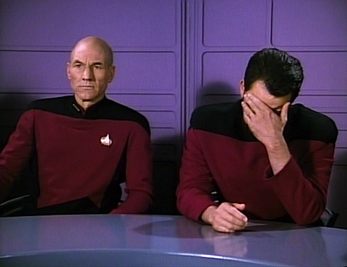

# The Galilean Moment of Quantum Mechanics

## Abstract

In this publication, I will discuss Carlo Rovelli's Relational Quantum Mechanics (RQM) and how it aims at resolving the measurement problem. Once I have explained how I think it works, I will point out an obvious type of criticism and how Rovelli tried to fix the problem. After this, I will show why it does not fix the issues, suggest a *much* better fix. In the section "Road to Formalization", starting from a simple change in notation that I recognized only later as novel and clarifying, I develop how some of this plays out mathematically.

## Table of Contents

- [The Galilean Moment of Quantum Mechanics](#the-galilean-moment-of-quantum-mechanics)
  - [Abstract](#abstract)
  - [Table of Contents](#table-of-contents)
  - [Note](#note)
  - [Back to Materialism!](#back-to-materialism)
      - [Wigner's Friend: A Thought Experiment](#wigners-friend-a-thought-experiment)
      - [Fixing Rovelli](#fixing-rovelli)
      - [Summary of my Two Postulates](#summary-of-my-two-postulates)
  - [Road To Formalization](#road-to-formalization)
  - [Some More Philosophical Consequences](#some-more-philosophical-consequences)
  - [Acknowledgements](#acknowledgements)

## Note

You are reading the version of this paper that is optimized for western academic philosophers of nature. A version taking a more interdisciplinary approach can be found [here](https://github.com/GermanBrainRot/Project-Galileo).

## Back to Materialism!

In [1996/97, Carlo Rovelli](https://arxiv.org/pdf/quant-ph/9609002) introduced the idea that descriptions of quantum systems could be observer-dependent. Here, "observer" does not refer to any "conscious" or "macroscopic" entity, but returns to the more sober and naturalistic meaning that the term used to have in physics prior to Quantum Mechanics - and which it still has in Special and General  (think: "point of view", "perspective", "coordinate system").

To motivate the idea of observer-dependence, he proposed a thought experiment which has since been [pointed out](https://arxiv.org/pdf/1710.07556) to be a restatement of the old thought experiment of Wigner's Friend. For the sake of clarity, I will therefore motivate Rovelli's idea starting from Wigner's Friend.

#### Wigner's Friend: A Thought Experiment

Eugene Wigner, like many physicists, once wondered what exactly constituted a measurement and what the mysterious "collapse of the wave function" during a measurement might mean.

For him, the collapse had to have something to do with quantum systems interacting with consciousness. Here's how he justified this:

Suppose, instead of Wigner himself conducting a quantum measurement, he would have a friend conduct the measurement. Wigner himself would stand outside of the lab. So far, so good.

Now, after the measurement, Wigner's friend comes out of the lab and is asked by Wigner about the outcome of the experiment. Notice something here: *from Wigner's point of view*, if quantum mechanics is correct, the answer must at this point be described using a superposition between the different possible outcomes. It is only upon hearing (i.e. "measuring") the answer that Wigner's description can collapse to a single state.

So, does this mean that Wigner's friend was in a superposition until that point as well? Well, let's find out! Wigner asks his friend: "what did it feel like to be in a superposition?" His friend looks confused, then replies: "What do you mean? I was not in a superposition!"

And this leads Wigner to the "only" correct interpretation: consciousness collapses wave functions! -

Yeah, except that this is obvious nonsense and has since been challanged in various ways. Today's consensus seems to be that it's not about consciousness, but about interactions with macroscopic environments which "decohere" into a single classical reality (more on this idea later).

In his key contribution, Rovelli added his own unique take: What if Wigner's friend truly *is* in a superposition - *for* Wigner? Yes, you read this right: Rovelli's solution boils down to stating that superposition for me can be facts for thee and vice versa.

In particular, this means that for Rovelli, the wave function is epistemic: it's just a book keeping tool to account for the state of systems that you have not interacted with yet.

You know what? This is actually a genius idea! I am *not* being sarcastic here. It's the *exact* type of idea that got us from Newtonian physics plus weird Lorentz transformations to account for the constancy of the speed of light for any observer to Einstein's relativity - and Rovelli is bold enough to draw this comparison himself in his initial paper.

Except, it doesn't quite work. Here's the problem:

If something can be a fact for one party (say, Alice), in limbo for another party (say, Bob) and once again a fact for a third party (say Charlie), who or what guarantees that Alice's and Charlie's facts agree once Bob learns of Alice's and Bob's notes?

Well, an [ad-hoc postulate](https://philsci-archive.pitt.edu/20379/1/RQM%20paper%20copy.pdf) does. After a quarter of a century, this rather obvious weak point had become bothersome enough that Mr Rovelli felt the need to just assert that this should work.

The way he attempts this is not without merits. At least, it hints at an ontology that could be responsible for this to work: each observer just carries the information about their measurement records around in some way, for example in correlations between observables. Nice! We avoid hidden variables simply by using *statistical correlations themselves* as the locus of physical information. Very elegant move!

But somehow, this is still quite slippery. Rovelli's idea how all this fits together forces him to write something like this:

*This postulate implies that the information stored in Alice’s physical variables about the variable V of the system S is accessible in principle to any observer who measures her in the right basis, so at least at an emergent level this information about V is an observer-independent fact.*

Excuse me? What if I measure her in the wrong basis? Is the information forever inaccessible to me? What does measuring "someone" in the wrong basis even mean?

Honestly, this sounds like Rovelli's interpretation slips right back into some version of Many Worlds - a criticism that he has been struggling with from the start. And indeed, the "fix" for this is to be found in the exact same place as with Many Worlds, as the "at an emergent level" part of the sentence I quoted gives away:

*It is clear that decoherence should play some role in this story. And in fact, decoherence provides exactly what it needed here: it picks out a basis which is dynamically favoured and then disseminates information stored in that basis through the environment.*

Mr Rovelli, didn't you want to treat the wave function as a book keeping tool rather than something physical? So, what is it that "decoheres" here? Certainly not quantum branches, right? How can a set of systems "decohere" into a single reality - unless you basically allow an ontic wave function and even Everettian branching again?

Alright, and *this* seems to be the state of the art here! At least as far as I am concerned, the mysteries have not *quite* gone away. If we invoke decoherence to explain the "emergence" of stable facts at the macroscopic level, we would have to say *what* decoheres. So, back to the drawing board!

#### Fixing Rovelli

What if we went a little further than Rovelli and simply treated facts as facts? That is: *measurement bases be damned*, once an interaction happened, *it is a fact*.

But hold on! Is this not in a direct contradiction with the idea that facticity or superposition should be *relative* to an observer, that is, *observer-dependent*? How can an interaction that happened *just be a fact* when *at the same time* we require that another observer who doesn't know about the interaction record yet could somehow still *validly* describe the situation as a superposition?

The answer is actually somewhat obvious once you read it. It is *so* obvious that I couldn't *believe* that it hadn't occurred to anyone for a quarter of a century - at least to my knowledge.

Mr Rovelli, was your theory not supposed to make Quantum Mechanics *directly* compatible with Special Relativity? In Special Relativity, whether an event has happened or not is *relative* to the observer! Just because the interaction already resides in the causal past of Wigner's friend, this does not mean that it is already in Wigner's causal past!

For the casual reader who might be confused about this, you can find a nice explanation how the speed of light is related to causality [here](https://www.youtube.com/watch?v=msVuCEs8Ydo) and how relativity of simultaneity (within a discussion of relativistic length contraction) [here](https://www.youtube.com/watch?v=TxW6_E3uLuo).

The above insight leads to a *natural* refinement of RQM. It is *not* an ad-hoc axiom or postulate, it is *well motivated* by known physics:

**Interaction records are factual for any pair of observers such that the interaction resides in the intersection of their causal past.**

If we simply dump everything we consider a definite fact into the shared causal past of all the observers for whom we require agreement, these facts can simply not bother any other observer; for there are only two other types of observers:

- Those who can never interact with the fact because, for example, they have fallen into a black hole  
- Those for whom the fact lives in the future and for whom the wave function is the absolute horizon

Once we make this adjustment - which is *squarely justified* by our current secure knowledge of the universe (but needs to be handled with a little more care later) - a lot of things suddenly make sense.

Let us now take a walk through the freak show of Quantum Mechanics like Thanos would because ... we kinda can:

**Schrödinger's Cat** - dead and alive, but what people forget to mention *even though basic relativistic common sense screams it in their face* is that learning about the live/dead state of the cat *implies* learning about whether the atom has decayed that would trigger the mechanism that would kill the cat. That is all that entanglement encodes! Information about an interaction entering your causal past means that an *entire consistent causal history* enters your causal past. If we position the experiment in such a way that the trigger is behind the cat from our perspective, the information about the entire sequence of events enters our causal past all at once.

**Retrocausality** - This one doesn't even need any special interpretation to be [thoroughly debunked](https://www.youtube.com/watch?v=RQv5CVELG3U), but I think the ontology we are building towards here suggests that Quantum Mechanics actually yells at us precisely that retrocausality is *not* real.

Think about it: when we see an interference pattern on the screen behind a double slit, isn't this precisely the universe telling us that it *can not* retroactively *create* the information through which slit the particle has gone? Because, if we were to see two peaks rather than an interference pattern, this *would be* nature coming up with a so far non-existant history on the spot. Once the particle has definitely made it past the double slit without being constrained to go either through the left slit or the right slit, we have condemned the particle's position *at this time* to be in a superposition for all eternity and that's all there is to it. It can have a position later if we measure it, but whatever we measure must be consistent with the particle *not* having had a definite position when it went through the double slit.

**Decoherence** - hitherto, it was assigned the role of Descartes' Demon who modern science has demoted from an intellectual tool to *criticize* our own bullshit to an underpaid lab assistant tasked with *justifying* the bullshit: The other branches are still there, we're just extremely isolated from them; *Therefore* (!), our inability to see other quantum branches is just our senses playing tricks on us.

But why should we evolve a consciousness so poorly suited to perceive actual reality? Suppose, the dinosaurs had survived on some other such “quantum branch” and were at the brink of developing the ability to perceive those hidden dimensions. Being eaten by an interdimensional T-Rex is quite a terrifying thought!  

Luckily, it is not real.  

All that decoherence does is to quantify to what degree small things enter into fewer relationships than big things, therefore revealing less about themselves to the universe than big things do. It estimates and quantifies the *“relationship density”* of a thing: for an individual particle, *it is perfectly fine* not to go through the left or the right slit at the double slit *because* it has so many ways *not to* interact with the world.

Think of it this way: if I was moving through outer space, I would always (in principle) be able to know where I am because I can triangulate my position relative to distant stars. We macroscopic entities live in an Argus universe, a quantum panopticon.

An electron, on the other hand, is not able to do that, because it is so small that the photons have a good chance to miss it. And then, *there is no fact of the matter*.

More philosophically: decoherence is “Hegel's Law” (“quantitative change [here: system size] leads to qualitative change [here: weird absence of facts vs classical facticity]”) of quantum mechanics.

**The Block Universe** - This one also doesn't really need a new interpretation of QM to be debunked, as it arises more out of General Relativity than Quantum Mechanics; the simplest criticism is that solutions to Einstein's field equations are solutions because they *satisfy* the field equations, thereby giving all observers (i.e. infinitesimal regions that experience a flow of time) a way to coexist even though that appears contradictory from a Euclidean/Newtonian point of view.

Still: if - as my observation suggests - the past is full of facts and the future *actually has not happened yet* for us, that makes the whole notion of the block universe even more sus. Also, just because you have a closed form solution that you can traverse forward and backward in whatever way you like doesn't mean that this is physical. Moreover, closed form solutions fail to exist even in simple cases as the Newtonian (!) general three body problem, so you're taking comfort in the false promise of knowledge when *you know* you don't have access to that nebulous Platonic ideal.

**Superdeterminism** - It depends on what you *mean* by it.

If you take it to mean that there are any laws that allow you to *predict* future events that are insufficiently constrained by facts inscribed into your causal past, I wish you good luck but I do not hold my breath.  

If you take it to mean that you can, in thought, place yourself at the heavens of the "end of all world lines", I will admit that this works, but *you just made that position up*, and the minute you forget that, you condemn your future self to wrestle with the same kind of nonsense that we are wrestling with in the present.

**Counterfactual indefiniteness** - Star Wars already knew the answer:  

If an item does not appear in our records, it does not exist. 

Or to be more precise: What is *factual* is the record of the interaction, that is, the concrete values that observables took when interacting with each other (=measurement). The wave function is needed as an epistemic excess over the facts to explain their further development, making it at the same time ontic.

Now, you will say that this is contradictory bullshit, but if you do say that, I'm about to make you eat your words because there's *another* refinement we need to make to Rovelli's interpretation.

---

Rovelli's main point is that world descriptions should be *relative* to the observer. Rovelli himself then correctly concludes from this that the observer is *part* of the universe and we can not describe the universe "from nowhere in particular".

Very good, Mr Rovelli! (Again, if this sounds ironic or sarcastic, I apologize - I think this is genuinely good). But how to operationalize this? Alas, Rovelli is a little shy here. He assumes that Quantum Mechanics is basically complete, so we can just use its formal apparatus and maybe derive it from an axiomatic basis that makes sense. The best we get is some notation indicating that we are looking at a world description from a given perspective. That is a little disappointing.

**Alright, let's give it a shot then!**

Let us start with a simple observation: in everyday language, relativity "removes" facts. This is, I think, the trap that Rovelli has fallen into. What relativity *actually* does is that it *refines* our notion of what counts as a fact.

In mathematics, this is well known. It is the reason why we pin objects down "up to isomorphism" and work out properties that are invariant under these isomorphisms. In category theory, this concept is known as "universal properties". And in theoretical physics, there is a notion of "gauge invariance" that is related to this.

In the narrow sense, a gauge (here: Yang-Mills gauge) can be thought of as a set of symmetries so that contributions to interactions are redundant and naively summing them all up would over-count. It's basically a very fancy dx in an integral.

In a broader sense though, we come right back to the familiar notion from pure mathematics: if we know how spacetime works, we can change our coordinates - and whatever changes we observe through such a move, we would not interpret them as a change of the physical *facts*. That is: what is a fact is that which is left invariant under all admissible perspective changes.

Alright, let's do this for Quantum Mechanics then!

If I am a measurement aparatus, what is measurement *about* from my perspective? Fundamentally, it is about *other* quantum objects, *not* about me. I can not see myself directly! I *can* see what *other* objects are doing, but I must infer anything about myself from observations of the rest of the world. Whatever we do: to get a *complete* picture of reality, we must try to learn not only about the outside world, but also about ourselves and our causal impact *by using the universe as a mirror*.

This suggests that we have to restrict what we mean by "fact" to anything that is true from the point of view of any observer *as we leave this observer out of the picture*.

Here, it also becomes a bit clearer what an "observer" could even be. In essence, it's a set of correlated observables moving from one interaction to the next one. In general, such a "causal principle" can branch apart: just because the N observables all participated in one interaction, this doesn't mean that all N of them will participate in the next interaction - this should actually be more of an exception in general. But under certain circumstances, we end up with self-reinforcing interactions so we can treat all the involved observables as one very complex "macroscopic" observable.

Oh, and by the way: in case you didn't notice it, I have answered in what way the wave function is *both* epistemic *and* ontic at the same time now. Which by the way also answers why it seems to difficult to commit to either stance.

Pause here if you need another minute.

Ready?

Well, if the observer lives *inside* the universe, then *his* epistemic wave function through which he understands the past and predicts the future *must be physical*.

#### Summary of my Two Postulates

Let me repeat my two postulates again for clarity.

1. Real facts live in the causal past that any set of given observers share in common; that is: they live in the intersection of their past light cones. Access to those facts is granted through interactions, and consistency becomes possible because facts are just facts.

2. Whatever counts as physically real must be invariant under perspective changes between different quantum observers which I take to mean any maximal set of correlated observables that participate in two successive interactions that matter to the dynamics we try to describe. This includes facts about particles at a given time that have been revealed through interactions (and that would not have meaning outside of the context of an interaction); but what is real *also* includes the wave function associated to each observer which *for them* can be interpreted as the epistemic connective between past and future - the substrate of cause and effect. A *perspective* is a description of the world that "leaves the observer out of the picture", that is, the observer is a set of *hidden variables* that he can only know about via inference over the outside world.

With all of this, [Bell’s beables](https://arxiv.org/pdf/2305.16194) become *becomables* which live at the same time at the point of an interaction *and* in the onto-epistemic wave functions growing out of interactions.

Let's see how this plays out!

---

Let us have a look at what my second postulate does for the Schrödinger’s cat thought experiment.

 
It is *here* that we see most clearly (without formalizing it yet) what my second postulate *means*. Herr Schrödinger keeps checking in on the cat, say, every 30 minutes to see if the cat is still alive or not - until it is dead. But Herr Schrödinger can *only* observe the cat and the quantum contraption that will eventually kill the cat. He can *not* directly observe himself - yet he knows that he is somehow part of the story.
It is a *riddle*: Herr Schrödinger's task is not only to find out whether the cat is dead and alive; in order to understand the experiment *in its entirety*, he has to come to an understanding *about his own role* in the experiment. And since he can not see himself, he has to infer his own causal impact on the situation *by observing how the situation unfolds*. The situation becomes a *mirror* for him.
So, how do we have to complete this causal picture so it makes sense?

It’s *YOU*, Herr Schrödinger! Yes, you.

YOU killed the cat. Just because you put the knife into the hands of the Brutus that is the Cesium atom, this does not absolve you from your causal contribution. Saying “the Cesium atom’s decay caused the cat’s death, I didn’t make it decay!” is a CHEAP way out of your responsibility. YOU sick sadistic freak set the thought experiment up in such a way that the cat would *have to* die - the only thing you gave out of your hand was the information about when it would happen.

---

It would appear that we can now make sense of the wave function even at the macroscopic scale. The difference between quantum and macroscopic scales is indeed the extent to which facts are established through a gigantic web of interactions.

Let me point this out with another example.

If you saw a snapshot of a[ tea pot in space](https://en.wikipedia.org/wiki/Russell's_teapot), what would you think where it should go? I don’t know about you, but I would not have any expectation whatsoever, meaning I would have to begin with a totally unconstrained prior on its momentum which is at the moment *nowhere to be found* in nature.

Only when information about the position of the tea pot becomes causally available to me would it and I simultaneously *wake up* to each other’s position, while also giving us a hint at who we are, how we got here and where we’re going. It would appear that macroscopic "momentum" of relatively simple objects is just an encoding of the effectively very low dimensional causes driving the motion of the very dull system, and that talk of "momentum" of quantum objects is actually misleading. At the quantum level, it's pure causality!

In other words: The wave function is the substrate of *cause and effect* which in different setups constrains things in different ways.

With this, the following mystery also suddenly makes sense:

**The arrow of time** - Rather than being another delusion to be explained by some “consciousness” voodoo, it is directly encoded in the evolution of the facts which can only be explained by an objective fabric of causality that our neat wave function models can converge against. Entropy grows precisely because the storage volume of this fabric is bounded by the degrees of freedom of the wave function.

This last part about the possibility of information being *destroyed* is something that Rovelli toys with as well in his more recent work, but he does not commit to the claim that this necessarily implies time-asymmetry. My causal-past refinement *does* strongly suggest such an asymmetry.

## Road To Formalization

From these sources of philosophical inspiration, I attempted to write a [scientific article](https://github.com/GermanBrainRot/Project-Galileo/blob/for-western-audiences/LaTeX). As of the time of writing these lines, I have become aware of a technical problem. I know exactly how to fix it, but to make the article fly on arxiv, I will have to do a complete rewrite which I am unable to do within my self-imposed deadline for *this* publication. I will leave the article *with* the technical flaw at the location that the link points to for the reader interested how I developed my ideas. And yep: it's part of this very git repo! If my ideas are as interesting for the scientific community (once I worked them out properly) as I think they should be, this may be a treasure for future historians.

Just a small teaser:

- I found out that there is a way to define *dynamically* when an interaction actually occurs.

- I learned in what way the Born rule can branch *wave functions* into different "worlds". My worlds are *not* the traditional "Many Worlds" though. They only "exist" as unrealized potential in the future, that is, they are a prediction. Once something happens, it becomes part of a definite past that eventually everyone we could possibly interact with will agree on.

- I convinced myself that this *does* make predictions, but that standard unitary evolution and all experiments I looked at *should* be explicable as a limiting case of my dynamics.

To the western academic who somehow has missed this even though they are way smarter than me, I want to say:
You don't want to sell us any more quantum opium, you want to go home and rethink your lives.

In case you are curious enough to wonder *what* to rethink, please consider reading the "more interdisciplinary" version mentioned in the beginning. Don't worry - up to this point, they are virtually identical except for the remark about the version and the table of contents.

## Some More Philosophical Consequences

Let me close the physics part with one more consequence that is quite a bit more speculative:

**"Free Will" -** We make arbitrary "choices" as long as we are ignorant the consequences of our actions. As we become aware of the consequences through experience, we can not help but make more predictable choices. This is the old Hegelian paradox of [freedom as insight into necessity](https://www.marxists.org/archive/marx/works/1877/anti-duhring/ch09.htm): our freedom *to* make arbitrary choices *diminishes* as our freedom *from* ignorance about the consequences grows. And in the Quantum picture, the development from arbitrariness to clearly predictable patterns (thanks to tons of constraints through relationships) ceases to be merely epistemic and becomes ontic.

---

That’s the type of shit that people leaning towards analytic rather than continental philosophy would miss. Their logic is instrumental to solve problems, but it can never stop and ask what the problem even *is*.

Let me drive this home in a very immediate way: do you think this text contains any knowledge whatsoever? If you just thought “yes”, then *you are a fool*.

As Hegelians knew for ages: [he who studies the past is studied by it](https://www.youtube.com/watch?v=PIz4fNrdpWU) (Yes, Hegel *did* watch that DS9 episode, making either him or DS9 the only instance of time travel allowed by the laws of physics). This text is studying you, judging whether you are worthy of the mutual knowledge that could be produced between you if you cared enough to seriously engage with it and refine your understanding, possibly by reaching for outside references if you get stuck. Conversely of course, the world is judging the text and mutual knowledge production can only commence once people have a good reason to read my nonsense.

 What I am saying here is that knowledge is *produced* and *reproduced* as you engage with a text. *Nobody* today knows what, for example, the Incan Quipus (their knot-encoded “written” language) *meant*. Maybe, one day, we succeed in recovering this information by stumbling upon outside reference, but to us, they are mostly a riddle - all because past actions have cut the present off from those who knew how to read them.

By the way: I mean this quite literally. We are teasing out an important distinction here: *information* versus *knowledge*. If we follow Rovelli's reasoning, this physical instance of the text that you are reading - no matter if it's represented with ink or bits and pixels - *contains* information about some causally potent principle, the "abstract" text. *Your* engagement with the text reproduces and produces *living* knowledge.

And yes: If we take "causal information = correlation" to its logical conclusion, this means that the evolving *meaning* of the text for different readers is as physical as the momentum of an asteroid floating through space (which, by the way, is also observer-dependent as an observer in the same rest frame would describe the asteroid as stationary). And if you can still take me seriously here, I would hope that this gives you pause when scientists in other disciplines try to explain things in mechanistic bottom-up terms while ignoring more complex channels of causality (for example: over-focusing on DNA when explaining how traits are replicated in a population while ignoring more macroscopic channels of trait replication - like for example going to school. Your genes did not determine that you know how to read this text! And if there is trait replication at the molecular and at the social level, why not at all the levels in between? Or even... *above*! For example, the fact that Earth has reproduced its orbit for billions of years rather than being cast out of the solar system *might* also have something to do with you being able to read these lines - just as much as the fact that you live in a civilization that permits the maintenance of copies of this text and allows you to set aside enough time to read and understand this. Some molecule didn't do all the necessary reproduction here).

 That you can find your own causal impact in the world that you live in can literally be understood as "what goes around, comes around". Actions have consequences, and with great power comes great responsibility. Your attitude to the life, the universe and everything *matters*.

And if what I wrote contains any truth, then I can proclaim **metaphysics dead again**!

## Acknowledgements

“Enlightenment is man's emergence from his self-imposed immaturity. Immaturity is the inability to use one’s understanding without guidance from another. This immaturity is self-imposed when its cause lies not in lack of understanding, but in lack of resolve and courage to use it without guidance from another. Sapere Aude! 'Have courage to use your own understanding!' - that is the motto of enlightenment.”  

\- *Immanuel Kant*

“My dialectical method is, in its foundations, not only different from the Hegelian, but exactly opposite to it. For Hegel, the process of thinking, which he even transforms into an independent subject, under the name of 'the Idea', is the creator of the real world, and the real world is only the external appearance of the idea. With me the reverse is true: the ideal is nothing but the material world reflected in the mind of man, and translated into forms of thought.
The mystification which the dialectic suffers in Hegel's hands by no means prevents him from being the first to present its general forms of motion in a comprehensive and conscious manner. With him it is standing on its head. It must be inverted, in order to discover the rational kernel within the mystical shell.“

\- *Karl Marx*

On the physics part, I want to express my special gratitude to:

- Looking Glass Universe from whom I have learned that measurements and entanglement are [deeply interconnected](https://www.youtube.com/watch?v=xBlpOGdk-0U&). In fact, this had me intuit that this should be an equivalence principle \- independently of Rovelli. Many thanks for making sense\!

- ChatGPT which told me that I had discovered nothing new with this relativity, just something so obscure it had not made it into the general discourse.  
  Except, further engagement with the matter led to the realization that I *had* discovered something new, because for whatever reason, academics seem to be unable to put 2 and 2 together.  
  And the worst part? The actual insight had been known to us since Everett’s work, which is why it just so happened to give rise to the new quantitative tool of decoherence. Except, he had everything backward.  
  Also, ChatGPT was my most productive critic, forcing me to relentlessly refine my arguments. The old words are very true: give the capitalists enough rope, and they will hang themselves.

- PBS Space Time for [coming so close to something real, yet getting it totally wrong](https://www.youtube.com/watch?v=1JCRDaa3ehk). The “present foliation” is not only arbitrary, it is, when taken as ontic, a Newtonian fossil. What must be understood about solutions to PDEs is that they are solutions because they *satisfy* them. That is, whatever shape the solution may take, it can not possibly prove that the differential that gave rise to it isn’t real, but on the contrary: it gives it a home.

- Science Asylum whose [graphical explanations with squirrels](https://www.youtube.com/watch?v=5HKH1ZjGutA) I trust more than the formalistic cope that had him walk back his fresh approach to make General Relativity make *sense*. In the future, please stick to your own lesson that we need *better* nonsense, not worse. Keep at it! What you have been doing is exactly what the revolutionary proletariat desperately needs.

**Dedicated to**

**The American Communist Party**

**The Communist Party of China**  (and I encourage western media to finally learn that it's CPC, NOT CCP!)

**Komitee Basierter Deutscher (Chat Group)**

**Darmstadt für Palästina**

**Palestine itself**

**People's MAGA**

**Tung Tung Tung Sahur**

**And last but not least:**

**MY WIFE.**

**I LOVE YOU.**

[Markus Kasperczyk](https://x.com/comradeKangaroo)

14th of August 2025 \- 23rd of September (scheduled release)
Hesse, Germany

